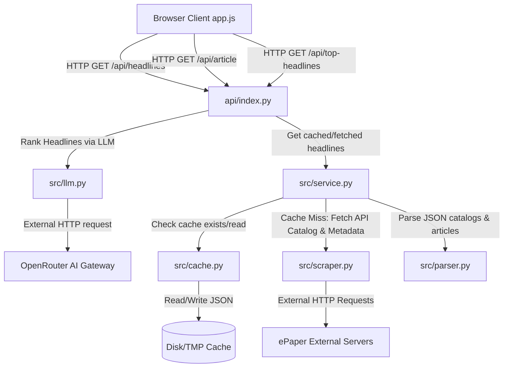

# Developer & Agent Onboarding Guide (AGENTS.md)

Welcome! This guide provides a comprehensive overview of the architecture, workflow, technologies, testing paradigms, and deployment configurations of the **The Hindu ePaper Reader** project. Use this document as context before making modifications to the codebase.

---

## 1. System Architecture Overview

The system is split into a **Python FastAPI backend** and a **Vanilla HTML/CSS/JS frontend**. 



### Request Lifecycles

#### A. Headlines Retrieval (`/api/headlines?date=YYYY-MM-DD&city=th_city`)
1. **Validation**: Date format is verified using regex (`^\d{4}-\d{2}-\d{2}$`). If invalid, API returns `422 Unprocessable Entity`.
2. **Cache Check**: [src/cache.py](file:///Users/kushagragupta/Desktop/Projects/antigravity/the-hindu-newspaper/src/cache.py) checks if a parsed JSON file exists for the requested date and city.
   - **TTL Rule**: Today's paper cache (in Indian Standard Time) expires after **24 hours** from file creation. Past papers **never expire**.
3. **Cache Hit**: Instantly returns the cached JSON content.
4. **Cache Miss**:
   - [src/scraper.py](file:///Users/kushagragupta/Desktop/Projects/antigravity/the-hindu-newspaper/src/scraper.py) fetches the issue catalog, searches for the correct numerical `issue_id` matching the `city`.
   - Scraper fetches the `cciobjects` JSON payload containing page structure and article metadata.
   - [src/parser.py](file:///Users/kushagragupta/Desktop/Projects/antigravity/the-hindu-newspaper/src/parser.py) extracts page lists, filters out layout noise, resolves `.html` article content file references, and deduplicates image paths.
   - [src/cache.py](file:///Users/kushagragupta/Desktop/Projects/antigravity/the-hindu-newspaper/src/cache.py) writes the clean parsed payload atomically and returns the JSON.

#### B. Article Details Retrieval (`/api/article?city=th_city&issue_id=num_id&ref=file_name.html`)
1. Resolves the internal article ID from the `ref` parameters.
2. [src/scraper.py](file:///Users/kushagragupta/Desktop/Projects/antigravity/the-hindu-newspaper/src/scraper.py) fetches raw HTML content of the article from external servers.
3. [src/parser.py](file:///Users/kushagragupta/Desktop/Projects/antigravity/the-hindu-newspaper/src/parser.py) parses HTML using BeautifulSoup, extracting structured elements (Headline, Author/Byline, Dateline, Body paragraph text array, Highlights/Liftouts).
4. Returns the clean JSON object.

#### C. AI Editor's Picks Curation (`/api/top-headlines?date=YYYY-MM-DD&city=th_city&limit=num&generate=true/false`)
1. **Validation**: Date format validation (`YYYY-MM-DD`) and limit check (positive integer).
2. **Cache Check**: [src/cache.py](file:///Users/kushagragupta/Desktop/Projects/antigravity/the-hindu-newspaper/src/cache.py) checks if ranked cache data exists (`{city}_top.json`).
   - **TTL Rule**: Today's top picks cache expires after **24 hours** from file creation. Past papers **never expire**.
3. **Cache Hit**: Returns cached top articles sliced to the requested `limit`.
4. **Cache Miss**:
   - If `generate` is not `"true"`, returns `{"status": "not_generated"}`.
   - **Self-Healing Loader**: If the main headlines cache (`{city}.json`) is missing, the API calls `service.get_headlines` internally.
   - [src/llm.py](file:///Users/kushagragupta/Desktop/Projects/antigravity/the-hindu-newspaper/src/llm.py) compiles the list of headlines and triggers a ranking call to OpenRouter.
   - **Enrichment & ID Normalization**: The API parses the LLM JSON response and maps selections back to source articles using case-insensitive suffix-stripping ID normalization.
   - Saves the entire enriched list to `{city}_top.json` cache and returns the top items sliced to `limit`.

---

## 2. Directory Layout & Tree Structure

Below is the directory tree layout showing key files and directories:

```text
.
├── AGENTS.md                   # Agent & developer onboarding guide
├── api
│   └── index.py                # FastAPI API endpoints, static assets mount
├── data/                       # Local disk cache folder (ignored in Git)
├── experiments
│   └── run_tests.js            # Node CLI unit test runner using DOM-mock context
├── pytest.ini                  # Pytest configuration file
├── requirements.txt            # Python requirements (e.g., fastapi, requests, bs4, pytest-cov)
├── src
│   ├── __init__.py
│   ├── cache.py                # Persistent caching logic and tmp routing
│   ├── llm.py                  # OpenRouter LLM interface with fallback logic
│   ├── parser.py               # BeautifulSoup HTML parser and JSON sanitizers
│   ├── scraper.py              # External HTTP fetch wrappers
│   └── service.py              # Scrape, parse, cache orchestrator
├── static
│   ├── app.js                  # Frontend client controller & layout engine
│   ├── index.css               # Newspaper typography system, variable themes
│   ├── index.html              # Main HTML semantic skeleton, loader, and overlay
│   ├── tests.html              # Frontend unit test page (Mocha/Chai)
│   └── tests.js                # Frontend unit tests suite
├── tests
│   ├── conftest.py             # Mock fixtures (catalog, cciobjects, article html)
│   ├── fixtures/               # HTML/JSON static mock payloads
│   ├── test_api.py             # FastAPI routing and HTTP error checks
│   ├── test_cache.py           # Cache read/write, TTL, and tmp directory checks
│   ├── test_e2e.py             # Basic flow integrations
│   ├── test_llm.py             # OpenRouter mock client and parser tests
│   └── test_parser.py          # HTML elements and image deduplication checks
└── vercel.json                 # Vercel deployment and rewrite rules config
```

---

## 3. Implementation Context & Critical Gotchas

> [!IMPORTANT]
> **A. Serverless/Vercel Environment Cache Redirection**
> Standard serverless environments on Vercel are read-only.
> * `src/cache.py` resolves `CACHE_DIR` to the writable directory `/tmp/thehindureader-cache` if serverless indicators (`VERCEL`, `VERCEL_ENV`, `AWS_LAMBDA_FUNCTION_NAME`, `LAMBDA_TASK_ROOT`) are present.
> * `CACHE_DIR` is evaluated at **import time**. When writing tests for serverless cache behavior, you **MUST** reload the cache module manually:
>   ```python
>   import importlib
>   import src.cache
>   importlib.reload(src.cache)
>   ```

> [!WARNING]
> **B. Mojibake and UTF-8 Encoding Overrides**
> The external servers don't always specify a character set in their headers, causing `requests` to fallback to `ISO-8859-1`. This turns smart quotes and em-dashes into mojibake (e.g. `â`). To prevent this, all HTTP requests in `src/scraper.py` force UTF-8 decoding:
> ```python
> response.encoding = 'utf-8'
> ```

> [!NOTE]
> **C. Image Reference Deduplication**
> Photo attachments often appear twice in raw payloads (both in the parent article content block and the nested `Photo` section). Inside `src/parser.py`, we deduplicate image references using `list(dict.fromkeys(images))` before writing to cache.

> [!TIP]
> **D. Frontend Noise Filtering**
> Promotional ads, puzzles, and layout codes are dynamically filtered from the newspaper sections in `static/app.js` via the `isNoiseArticle(headline)` filter. It rejects:
> * Headlines starting with `"promo"` (case-insensitive).
> * Edition/layout files starting with year prefixes (e.g. `23bg...`, `26ch...`).
> * Placeholder codes containing keywords like `page1`, `sirpage`, or `stadiump-age`.

> [!CAUTION]
> **E. FOUC (Flash of Unstyled Content) Prevention**
> Visual theme initialization is handled directly inside an inline `<script>` block in the `<head>` of `index.html` (checking `localStorage`). Never move this logic to `app.js` or defer its execution to ensure a flash of incorrect styling is prevented.

> [!IMPORTANT]
> **F. OpenRouter Credentials & Constraints**
> Generating AI Picks requires the `OPENROUTER_API_KEY` environment variable.
> * **Model Fallback**: Uses `openrouter/owl-alpha`, then falls back to `z-ai/glm-4.5-air:free`, then `google/gemma-4-31b-it:free`.
> * **Timeout**: Call timeout is set to 8 seconds to stay safely within Vercel's 10-second serverless response window.

> [!NOTE]
> **G. LLM Prompt Injection & Suffix Sanitization**
> To block prompt injection within raw headline strings, `src/llm.py` filters compilation entries by stripping out newlines and converting `<` and `>` into `[` and `]`. Additionally, ID normalization uses suffix-stripping matching (splitting IDs by `.` and taking the first part) to correctly match LLM selections back to active article references.

---

## 4. Testing Paradigms & CLI Commands

We enforce a strict **100% code coverage** policy on all Python backend code.

### A. Run Python Backend Tests (Pytest)
Run pytest with full coverage tracking on both backend and API endpoint files:
```bash
PYTHONPATH=. .venv/bin/pytest --cov=src --cov=api --cov-report=term-missing tests/ -m "not e2e"
```
Ensure that **all modules** report **100% Cover** metrics.

To run end-to-end integration tests (requires `OPENROUTER_API_KEY`):
```bash
OPENROUTER_API_KEY="your_key_here" PYTHONPATH=. .venv/bin/pytest tests/
```

### B. Run Frontend JavaScript Logic Tests
You can run the Javascript unit tests in your terminal using the Node CLI:
```bash
node experiments/run_tests.js
```
*Note: This script mocks the browser environment (global window, document selectors, local storage, and intersection observers) locally in plain Node.js to evaluate `static/app.js` and `static/tests.js` without any external node package dependencies.*

Alternatively, open `static/tests.html` in a web browser to run the visual Mocha/Chai test runner.

---

## 5. Deployment Workflow

1. Verify that all Python tests and Node JS tests pass locally.
2. Stage modified files individually (do NOT use blanket `git add .` command).
3. Commit and push. Pushing to `main` triggers automatic deployment hooks to the live Vercel environment.
