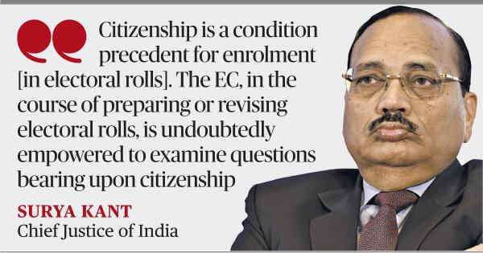

# SC upholds SIR, says it is EC’s constitutional duty

**Author:** Krishnadas Rajagopal | **Location:** New Delhi

---

The Supreme Court on Wednesday upheld the special intensive revision (SIR) of electoral rolls as an exercise done by the Election Commission (EC) in furtherance of its constitutional obligation to conduct free and fair elections.

“SIR bears a direct nexus to the constitutional goal of a free and fair election. Free and fair elections do not rest merely upon the mechanics of polling. They equally depend upon the integrity, accuracy, and purity of the electoral roll which forms the foundation of the democratic process,” a Bench of Chief Justice of India Surya Kant and Justice Joymalya Bagchi said.

The judgment affirming the constitutionality of the Bihar SIR will have an impact on further rounds of the exercise.

The court dismissed the view of the petitioners that the SIR was a backdoor attempt to conduct citizenship screening in the name of “purifying” the electoral roll of “aliens”. The EC was well within its authority to verify citizenship to the limited extent of determining inclusion or exclusion from the electoral roll, it said. “Citizenship is a condition precedent for enrolment. The EC, in the course of preparing or revising electoral rolls, is undoubtedly empowered to examine questions bearing upon citizenship,” Chief Justice Kant, who authored the 124-page judgment, observed.

The court directed the poll body to refer, within the next four weeks, the names of electors who were part of the 2003 electoral roll but were purged in the Bihar SIR on the grounds of being non-citizens, to the Centre for adjudication by a competent authority under the Citizenship Act.
