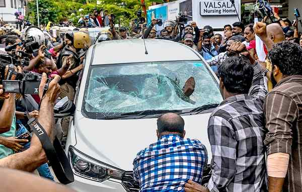

# ED searches Pinarayi’s houses; protests erupt

**Author:** The Hindu Bureau | **Location:** Thiruvananthapuram

---

The Enforcement Directorate (ED) on Wednesday searched the residences of former Kerala Chief Minister Pinarayi Vijayan in Kannur and Thiruvananthapuram over an alleged pay-off scam involving his daughter T. Veena’s IT firm and the Cochin Minerals and Rutile Limited (CMRL).

The simultaneous searches at 10 locations in Kerala and Bengaluru triggered protests across Kerala with a group of people vandalising vehicles ferrying ED officials after they left Mr. Vijayan’s residence in Thiruvananthapuram following a seven-hour search. Five CPI(M) activists have been detained in connection with the violence and the police have named 12 other persons as accused for the attacks on the central agency officials.
