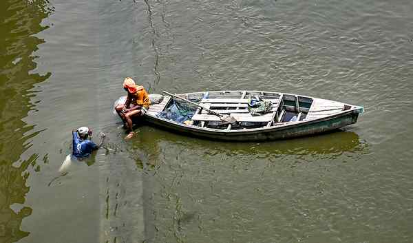

# Union Home Secy.-led panel to draw up plan to clean Yamuna

**Author:** Krishnadas Rajagopal | **Location:** New Delhi

---

The Supreme Court has constituted a committee headed by Union Home Secretary Govind Mohan, and comprising the Chief Secretaries of all the States and Union Territories through which the Yamuna river flows, and given them eight weeks to come up with a comprehensive plan to clean up the river, which is considered a lifeline for over 57 million people in the national capital.

A Bench of Justices Manoj Misra and Manmohan issued the direction to the committee to prepare a Yamuna Action Plan while conveying “profound grief” that the river has been reduced to “little more than a sewage canal”. “This court has repeatedly emphasised the absence of a single, comprehensive action plan for the rejuvenation of the Yamuna. A river is greater than the sum of its parts. Its revival requires a long-term, integrated strategy akin to the Namami Gange programme,” the apex court observed in its May 21 order that was published on Wednesday.

The court said the action plan for the Yamuna must clearly state the objectives, implementation strategy, roles and responsibilities of each agency, budgetary allocations, as well as timelines. Coordination and monitoring must be entrusted to a single authority, it said.

The Centre had previously suggested that the Union Home Secretary could act as the nodal officer to coordinate efforts between States, UTs and the Centre. The court’s amicus curiae, senior advocate K. Parameshwar, had recommended that the action plan must contain details of the cities and towns discharging effluents into the river; the kinds of industries polluting its waters; geotagging of sewage treatment plants, and drains, etc. on its banks; uploading of the river’s water quality data, among other measures.

“Rivers are the lifeblood of civilisation. They provide fresh drinking water, sustain ecosystems and drive economic growth through agriculture, fisheries, and tourism,” observed the two-judge Bench.

‘Time for hard decisions’

It added that multiple agencies worked in silos to achieve nothing. Instead of curbing pollution, they had aggravated it, said the court, adding that the time had come for “hard decisions”.

The court listed the case next on August 8.
