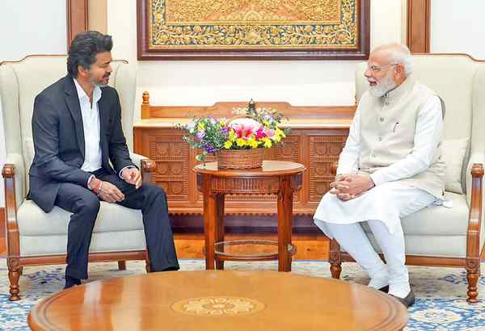

# Vijay calls on Modi; airs concerns over Mekedatu project, arrest of fishers

**Author:** The Hindu Bureau | **Location:** CHENNAI

---

Tamil Nadu Chief Minister C. Joseph Vijay on Wednesday called on Prime Minister Narendra Modi in New Delhi and discussed key issues concerning the State, including the Mekedatu reservoir project across the Cauvery and arrests of fishermen from the State by the Sri Lankan Navy.

The meeting at the Seva Teerth complex, which houses the Prime Minister’s Office, was Mr. Vijay’s first visit to the national capital to meet Mr. Modi after assuming charge as Tamil Nadu Chief Minister.

According to an official release, Mr. Vijay informed the Prime Minister that the Karnataka Deputy Chief Minister’s announcement regarding the conduct of ‘bhoomi puja’ for the Mekedatu project was “against the final award of the Cauvery Water Disputes Tribunal and the judgment of the Supreme Court”.

He urged Mr. Modi to instruct the Union Ministry of Jal Shakti and the Central Water Commission not to permit the project without the consent of the co-basin States of Tamil Nadu and Kerala, and the Union Territory of Puducherry.

The Chief Minister also informed the Prime Minister that the ‘Tamil Thai Vazhthu (Invocation to Mother Tamil)’ has traditionally been rendered at the beginning of all government functions in Tamil Nadu.

However, following a circular issued by the Union Home Ministry in January, the National Song, Vande Mataram, has been sung first at some government events. Mr. Vijay urged the Prime Minister to direct the Home Ministry to issue a clarification permitting the respective State invocation songs to be sung at the beginning of all government events.

The Chief Minister also requested the Prime Minister to press the Sri Lankan government for the immediate release of fishermen arrested by the neighbouring country’s Navy.

Mr. Vijay urged the Centre to take steps to establish the Centre for Airborne Systems in the State. He also thanked the Prime Minister for bringing back the Anaimangalam copper plates to India during his visit to the Netherlands.

‘Allocate funds’

Later in the day, Mr. Vijay called on Union Finance Minister Nirmala Sitharaman at Kartavya Bhavan.

During the meeting, the Chief Minister said investments in key infrastructure projects are essential to sustain and accelerate the State’s growth. He urged Ms. Sitharaman to prioritise funding for highways, railway projects, ports, and industrial corridors in the State. He also requested her to allocate funds for implementing metro rail projects in Hosur, Coimbatore, and Madurai.

Mr. Vijay also asked the Finance Minister to take measures to establish Institutes of National Importance in the State.
