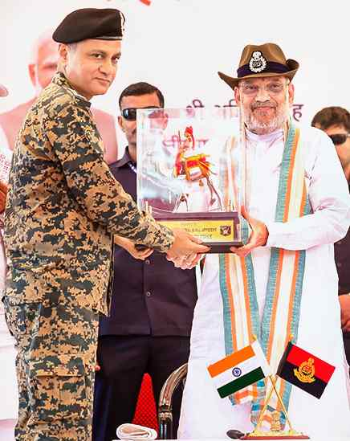

# Raze illegal structures within 15 km of border with Pakistan: Shah

**Author:** The Hindu Bureau | **Location:** New Delhi

---

Union Home Minister Amit Shah on Wednesday asked District Magistrates and Superintendents of Police of five border districts in Rajasthan to demolish illegal construction within 15 km of the International Border with Pakistan.

Mr. Shah gave the directions during a review meeting in Bikaner, Rajasthan, to assess security-related issues concerning the border districts. The meeting was attended by Rajasthan Chief Minister Bhajan Lal Sharma, Chief Secretary V. Srinivas, Union Home Secretary Govind Mohan, Secretary (Border Management) Rajendra Kumar, along with the District Magistrates and Superintendents of Police of the five border districts of Bikaner, Jaisalmer, Barmer, Sri Ganganagar and Phalodi. The meeting focused on enhanced and comprehensive border management in improved coordination with the State government.

“A decision was made to formulate a 360-degree security framework for every border district. This integrated approach will actively involve local citizens, the State government machinery, and all security agencies concerned to ensure robust border management,” read a statement from the Ministry of Home Affairs.

Zero-tolerance policy

It added, “Mr. Shah stressed the need for strict enforcement of a zero-tolerance policy against illegal constructions, particularly within 15 km of the International Border.”

The Home Minister emphasised a coordinated border management strategy by involving the Border Security Force, the Central Board of Direct Taxes, and the Narcotics Control Bureau, among other agencies, to effectively address offences such as infiltration, narcotics smuggling, and terror financing.
