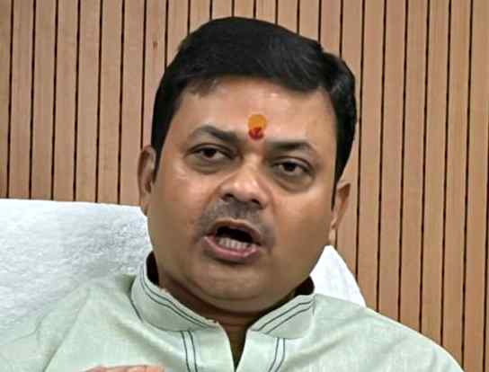

# Piped water to all pending Mahadalit tolas within three months, says Bihar Minister

**Author:** Amit Bhelari | **Location:** PATNA

---

Piped drinking water supply will be extended to all remaining Mahadalit tolas (hamlets) within three months under the ‘Har Ghar Nal Ka Jal Yojana’, Bihar Public Health Engineering Department Minister Sanjay Kumar Singh said on Wednesday.

“Our focus is to provide piped drinking water to Mahadalit tolas. Our target is to complete the installation of piped drinking water systems within three months,” Mr. Singh told reporters during a press conference in Patna.

The State government launched the scheme in 2016 to provide safe drinking water to rural households. Mr. Singh said the department is currently providing piped drinking water to more than 93% of households in the State.

‘Significant rise’

“2.66 lakh families were receiving piped drinking water in 2016, which has increased to 1.87 crore families in 2026,” the Minister said, adding that the department has set a target of covering 2.02 crore rural households in the State.

The department, which is primarily responsible for the supply of safe drinking water in rural areas, is providing drinking water across 1,14,450 wards, Mr. Singh said.

Asserting that the State has witnessed a significant improvement in groundwater levels between 2019 and 2026, he said the number of panchayats in the ‘very serious’ category, with groundwater levels below 50 feet, had declined to 19 in 2026 from 138 in 2019, a fall of 66%.

“Similarly, the number of panchayats in the serious category (40–50 feet) has declined to 186 from 468. Those in the medium category (30–40 feet) have declined to 1,158 from 1,270, while panchayats with water levels of 20–30 feet have declined to 2,213 from 2,529. The number of panchayats with groundwater levels within 20 feet, considered the best category, has increased to 4,222 in 2026 from 3,981 in 2019,” he added.
