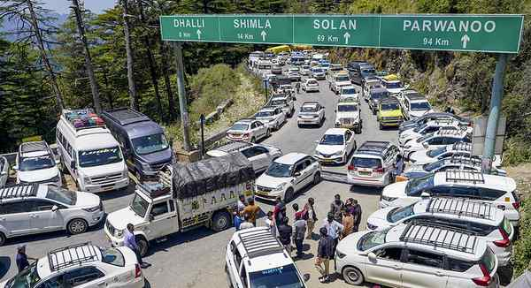

# Shimla chokes with vehicles as thousands throng hill station to escape heat in plains

**Author:** Press Trust of India | **Location:** Shimla

---

Tourists are flocking to the key hill destinations in Himachal Pradesh to beat the scorching heat in the plains, with as many as 6,31,000 vehicles reaching Shimla in the past 24 days, including 70,000 in the last 72 hours, the police said.

With the summer tourist season yet to reach its peak, Shimla, the ‘Queen of Hills’, is already choked with vehicles, leading to frequent traffic jams and prompting police to make a special appeal to tourists to adhere to traffic rules and conduct themselves as responsible citizens.

During the past 24 days, 3,70,000 vehicles reached the State capital from the Chandigarh-Kalka side, while a sizable number was routed via Kinnaur, Bilaspur and Kullu.

The sudden surge in tourist inflow has further compounded the perennial parking problem in Shimla, Assistant Superintendent of Police (ASP) Abhishek said on Tuesday.

Over the past week, 1,54,450 vehicles entered Shimla, with nearly 70,000 arriving in just the last 72 hours, mounting pressure on the traffic infrastructure, the ASP said.

“In response to the ever-increasing vehicular pressure, special arrangements have been made across the city. Shimla has been divided into five zones and the responsibility to manage traffic has been entrusted to a gazetted officer in each,” Mr. Abhishek said.

Volunteers enlisted

“Volunteers are also being enlisted to assist in managing traffic, while police are facilitating the use of alternative routes to ease congestion within the city,” he said. Accordingly, vehicles heading to Upper Shimla are being diverted via the Shoghi-Mehli route, the officer said.

Anticipating a further increase in tourist inflow from June, extra police force would be made available after the ongoing panchayat polls are over on May 31.
