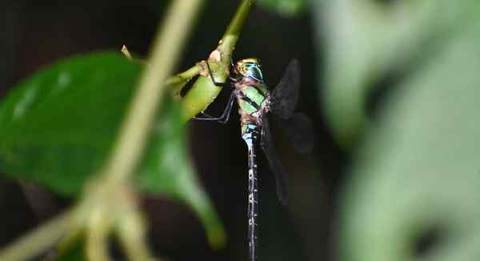

# Rare dragonfly resurfaces in Arunachal, underscores need for habitat protection

**Author:** Rahul Karmakar | **Location:** Guwahati

---

An insect that enjoys a near-360° vision with thousands of lenses, and can stay still in the air, has resurfaced in Arunachal Pradesh’s Changlang district, about 600 km east of where it was first recorded 110 years ago.

A team of four citizen scientists recorded Gynacantha khasiaca, a rare dragonfly commonly known as the long-tailed duskhawker, from the Namdapha National Park and Tiger Reserve. This insect with two compound eyes, each with thousands of tiny lenses and photoreceptor clusters, was last described from the erstwhile Abor Hills in 1914.

Mahesh R. from Kerala’s Ernakulum, Rajesh Gopinath from Karnataka’s BMS Institute of Technology and Management, Gaurav Joshi from Uttarakhand’s Haldwani, and Roshan Upadhaya, a policeman from Arunachal Pradesh’s Basar, are the authors of a study on the “rediscovery” published in the Journal of Threatened Taxa.

According to the authors, the long-tailed duskhawker was sighted at Deban in October 2024 and confirmed through photographs taken in the presence of the forest staff. They said that the finding has underscored the need for continued monitoring and habitat protection in India’s easternmost State.

Dragonflies and damselflies, belonging to the order Odonata, are crucial components of freshwater ecosystems, as predators and prey in the aquatic food web. The global diversity of Odonata comprises 6,442 species across 693 genera.

Home to 504 species

India is home to 504 species and 27 subspecies. The total number of species in Arunachal Pradesh is 110.

Beyond Arunachal Pradesh, the long-tailed duskhawker has been documented in Assam, Maharashtra, Meghalaya, Uttarakhand, and West Bengal.
