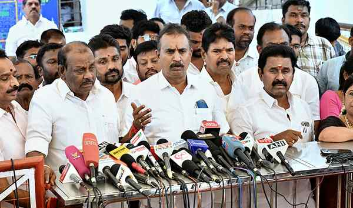

# AIADMK’s rival factions arrive at a truce two weeks after split of Legislature Party

**Author:** The Hindu Bureau | **Location:** CHENNAI

---

Nearly two weeks after the vertical split of the AIADMK Legislature Party, the rival factions — one led by general secretary Edappadi K. Palaniswami and the other by former Minister S.P. Velumani — arrived at a truce on Wednesday.

The rebel MLAs led by Mr. Velumani, barring senior functionary C.Ve. Shanmugam, presented letters to Speaker J.C.D. Prabhakar at the Secretariat, seeking condonation of their conduct of voting contrary to the direction issued by party whip Agri S.S. Krishnamurthy during the vote of confidence of Chief Minister C. Joseph Vijay-led government.

The Speaker, while speaking to journalists, said he would go through the petitions submitted earlier, as well as those submitted on Wednesday, and announce his decision on Thursday.

Speaking to reporters after meeting Mr. Prabhakar, Mr. Velumani said both factions had withdrawn the previous petitions, presented separately to the Speaker, seeking the disqualification of the legislators of the other group.

It all began with the vertical split of the AIADMK Legislature Party during the vote of confidence in the Assembly on May 13. A group of 25 rebel legislators led by Mr. Velumani voted in favour of the motion of confidence while 22 MLAs headed by Mr. Palaniswami voted against it.

Following the split, both factions submitted petitions seeking disqualification of the rival MLAs.

Meanwhile, on May 25, three MLAs from the rebel faction — Maragatham Kumaravel (Madurantakam), S. Jayakumar (Perundurai), and P. Sathyabama (Dharapuram) — resigned from their MLA posts, and later joined the ruling TVK.

On the same day, five other rebel MLAs — S.M. Sukumar (Arcot), P. Hari Bhaskar (Anthiyur), K. Mohan (Panruti), Dileepan Jaishankar (Sankarankoil), and N.S.N. Nataraj (Kangayam) — switched their loyalties to Mr. Palaniswami’s side.

The next day, another rebel MLA, Esakki Subaya, resigned from his MLA post and later joined the TVK while P. Balakrishna Reddy (Hosur) extended support to Mr. Palaniswami. With this series of resignations and switching sides, the strength of the rebel camp reduced from 25 to 15.

‘Difference of opinion’

Mr. Velumani said, “There was no division or split among us. We only had differences of opinion. We have urged the general secretary [Mr. Palaniswami] to constitute a committee to introspect on the party’s electoral defeats. He said he would take it up step by step.”
