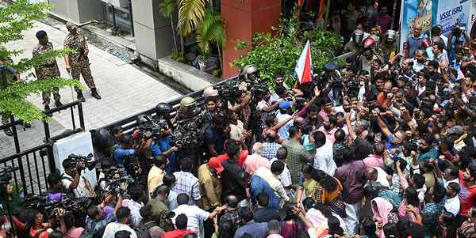

#  High drama outside Pinarayi’s residence as ED holds search

**Author:** The Hindu Bureau | **Location:** THIRUVANANTHAPURAM

---

The Enforcement Directorate (ED) operation at the residence of Kerala’s Leader of the Opposition Pinarayi Vijayan in Thiruvananthapuram on Wednesday turned into a tense political scene. The ED search led to protests by Communist Party of India (Marxist) [CPI(M)] workers across the State.

The search continued for nearly eight hours under the watch of CRPF and Kerala Police personnel.

Hundreds of CPI(M) workers gathered outside the residence, raising slogans against the Central agency and denouncing the action as politically motivated. Senior party leaders repeatedly appealed for restraint.

Emotionally charged scenes ensued as workers attempted to scale the compound walls and iron barricades.

After the ED team completed the search operation and prepared to leave the premises, officials, including women officers, came out of the house and moved towards their vehicles under CRPF protection. The vehicles were soon vandalised, with protesters damaging the front and rear windshields. A driver and three police officers sustained injuries during the attack, according to officials.

The deteriorating situation forced the police officers to baton-charge the activists. ED officials later submitted a formal complaint at the Thampanoor police station regarding the attack on the convoy.
