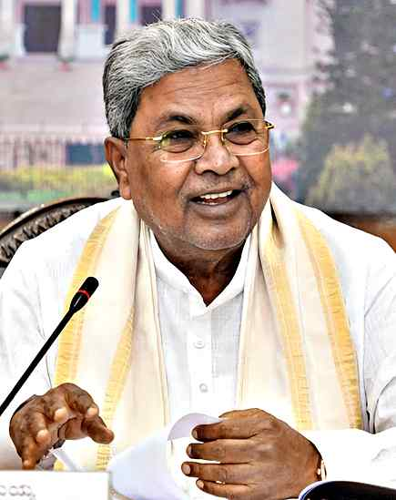

#  Siddaramaiah to meet with Cabinet colleagues today

**Author:** The Hindu Bureau | **Location:** Bengaluru

---

Amid fast-paced developments in Karnataka politics, all eyes are now on Chief Minister Siddaramaiah, who has invited his Cabinet colleagues for a breakfast meeting on Thursday. A day after being asked by the Congress high command to move to the Rajya Sabha, thus paving the way for a leadership change, speculation over his next move is likely to end as he is expected to spell it out during the meeting.

On Wednesday, some Congress legislators spoke publicly that he would resign on Thursday.

In his first interaction with the media after his New Delhi visit, Mr. Siddaramaiah refused to entertain pointed questions on leadership change in the State.

In a one-liner, he said, “I will speak tomorrow.”

While it is learnt that he is under pressure from some of his followers to continue in the post, the Chief Minister’s stand is likely to be known during the breakfast meeting, after which he is expected to address a media conference.

The All India Congress Committee General Secretary in charge of Karnataka Randeep Surjewala arrived in the city on Wednesday, apparently to smoothen the transition process. Mr. Surjewala also held deliberations with the Chief Minister later in the evening.

On the list of invitees for breakfast are his Cabinet colleagues, including Deputy CM D.K. Shivakumar, who arrived in Bengaluru from New Delhi on Wednesday evening.

Mr. Shivakumar has been a contender for the top post ever since the Congress government reached the halfway mark of its five-year-tenure in November 2025.

The breakfast meeting is at the Chief Minister’s official residence in Bengaluru at 9 a.m. There is an indication that he might meet the Governor later in the day.

Key OBC leader

Given the stature of Mr. Siddaramaiah as a senior leader and a key OBC face of the party, the Congress high command cannot push through a leadership change if Mr. Siddaramaiah does not show readiness for a transition.

Mr. Siddaramaiah is currently the only OBC Chief Minister among the four Congress-ruled States. Hence, the Congress high command is keen to ensure that the transition is smooth, and has him on board.
