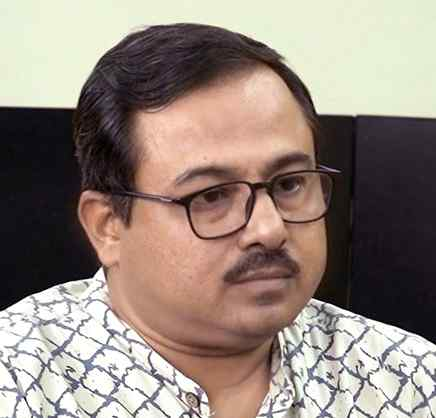

# ‘Restoration rate proof of wrongful deletions’

**Author:** Shiv Sahay Singh | **Location:** Kolkata

---

Citing the rate at which appellate tribunals are restoring the names of electors deleted during the special intensive revision (SIR) in West Bengal, Congress leader and social activist Prasenjit Bose on Wednesday said it proves how genuine voters were wrongfully deleted during the exercise.

“Appellate Tribunals were constituted by the Supreme Court to hear appeals, where around 25 lakh appeals against deletions are reportedly pending. Till May 14, 6,581 appeals were disposed of by the tribunals, restoring the names of 4,043 electors (61%). This provides evidence of how genuine electors were wrongfully deleted under SIR through opaque, arbitrary and discriminatory processes,” read a statement issued by him. Mr. Bose, who serves as the chairperson, SIR Committee of the State Pradesh Congress Committee, emphasised that with over 60% electors restored to the voter list, it is “clear” that genuine electors were deprived of their right to vote in the recently concluded Assembly election.

The remarks came on a day the Supreme Court upheld the SIR exercise in Bihar.
