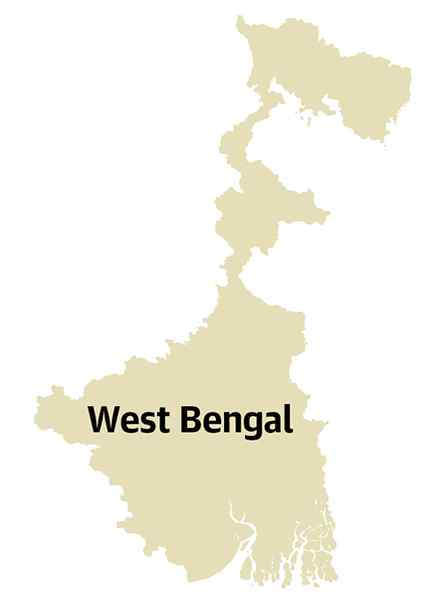

# The tug of war within the Trinamool

**Author:** Nistula Hebbar

---

Electoral defeat often follows a specific pattern — defiance, denial, implosion and acceptance. One can say that the Trinamool Congress is running true to type, with an earlier denial and defiance giving rise to a sort of implosion amidst its ranks, that may well lead to an acceptance of defeat.

However, the pattern in the specific case of the Trinamool and West Bengal is tweaked somewhat because of the presence of the political strategy company, the Indian Political Action Committee (I-PAC), and the recriminations being laid at its door for the debacle faced by the party in the 2026 Assembly elections.

Sidelining of party cadre

After the Trinamool’s loss in the recently concluded Assembly polls in West Bengal, the newly reappointed chief whip of the party in the Lok Sabha, Kalyan Banerjee, was the first to speak out over how I-PAC replaced the party cadre, and under the control of Abhishek Banerjee, Lok Sabha MP and nephew of former Chief Minister Mamata Banerjee, isolated the party from the people.

The next leader to speak out was long time Trinamool MP Dr. Kakoli Ghosh Dastidar, who resigned as district president of Barasat after the loss, and significantly after she was replaced by Kalyan Banerjee as the chief whip. She too pointed to workers being sidelined, especially the older cadres who had joined the party as founding members.

Nearly three weeks after the results have been out, it is quite clear that there are many who felt uncomfortable with the role played by the I-PAC within the Trinamool.

One of the unwritten rules of being a consultant is to be project specific, arrive at the client’s premises with no skin in the game, give a detached perspective on what is going right and wrong and help with implementing prescriptions for a short span of time. In the words of one political consultant: be like an Army that arrives, conquers and returns to its barracks, not like the police that is embedded in the locality. However, the I-PAC became a parallel structure within the Trinamool, advising on issues regarding the party, beyond 2021 when it first took on the party as its clients. They stayed on and became embedded in the party structure.

This was resented by the rank and file, not owing allegiance to Abhishek Banerjee, who have felt sidelined and unheard but feared falling afoul of whatever was happening between Mamata Banerjee loyalists and Abhishek Banerjee’s attempt to control the Trinamool. “They (I-PAC) had absolutely no manners of working; they spoke very rudely. These workers of ours, they aren't servants. We don't pay them a salary; they work out of love for Mamata didi and love for the party. They treated people poorly, and their arrogance grew to such an extent that they eventually began treating us badly as well. They seemed to think they were at a higher authority than even the Prime Minister. I don't believe I-PAC was directly under her (Mamata Banerjee's) control, because I-PAC is a distinct entity,” said Ms. Dastidar.

Succession games

The attacks on the I-PAC, and Mamata Banerjee’s distancing from it is thus a pointer to the fight between the Trinamool’s old guard and Abhishek Banerjee’s succession manoeuvres. Mamata Banerjee’s silence in the face of such allegations is instructive of the tug of war within the Trinamool.

Kalyan Banerjee and Kakoli Ghosh Dastidar have been old loyalists of Mamata Banerjee when she first formed the Trinamool in the heydays of the Left Front’s hegemonic control over the politics of West Bengal. In the last few years, especially since 2021, there has been a tug of war between Mamata Banerjee loyalists and the I-PAC-run Abhishek Banerjee camp. The painstaking labour required to gain organisational loyalty from leaders and workers was circumvented via the political consultancy firm. That this happened is not surprising, but that it took a defeat in the polls for it to be identified as a problem certainly is. Behind it likely lay the complications of loyalty, opportunity and the reluctance to pay the price of being a whistleblower. With elections now done, the costs are being counted and more importantly, through the attack on the I-PAC, the Trinamool Congress is now identifying a more problematic issue within the party — that of a succession war in leadership and its legitimacy.

nistula.hebbar@thehindu.co.in
