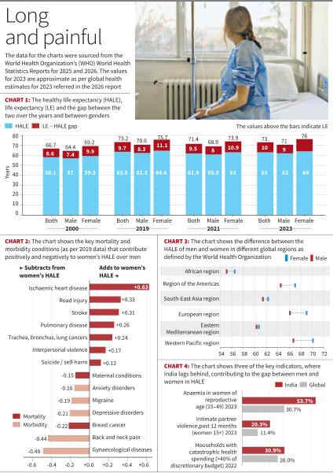

# Women live longer but spend more of those years with illness

**Author:** Devyanshi Bihani

---

That women outlive men is a long-established fact that the data on Life Expectancy (LE) at birth have repeatedly shown. However, the healthy-life advantage that should have come with a longer life has barely moved in two decades for women. The shifts that happened during the COVID-19 pandemic in LE and Healthy Life Expectancy (HALE) — a metric that adjusts the LE by discounting the time spent with illnesses, disability, chronic pain and poor health — partially showed why women continued to lag behind in HALE.

While the world had largely recovered from the pandemic with global LE returning almost close to pre-pandemic levels by 2023, HALE recovered to 63 years, which is 0.5 years lesser than what it was in 2019. Female life expectancy stood at 76 years, compared to 71 for men. But the gap narrowed when healthy years were considered: women’s HALE was 64 years, compared to 62 for men (Chart 1). In 2000, women’s LE was 4.8 years higher than men while the gap in HALE was just 2.3 years. By 2021, it had narrowed slightly, to 2.2. Despite a generation of medical progress, the gap between how many healthy years women get and how many men get has not moved. This pattern points to a deeper structural divide in global health: women survive longer, but spend more of those years living with illness, pain and untreated conditions.

Across the world, men die at significantly higher rates from cardiovascular disease, lung disease, accidents, violence and suicide. Lower mortality from ischaemic heart disease alone adds 0.63 healthy years to women’s lives. Reduced deaths from stroke contribute another 0.31 years, chronic obstructive pulmonary disease (0.26), road injuries (0.32), interpersonal violence (0.17) and suicide (0.12) (Chart 2). As per the World Health Organization, all these lower mortality factors together should have given women a 3.85-year advantage in HALE.

However, higher morbidity among women offsets 1.56 years of that advantage. Women carry a disproportionately high burden of pain disorders, gynaecological diseases and mental health conditions. Back and neck pain alone reduces women’s healthy lifespan by 0.44 years; depressive disorders cost 0.21 years and anxiety 0.16. Many remain underdiagnosed. The size of the female health gap varies sharply across WHO-defined global regions (Chart 3).

COVID-19 should have widened the HALE of women over men as the latter died at substantially higher rates than women throughout the pandemic. Lower female mortality from COVID-19 and pandemic-related causes alone gave women a 0.89-year HALE advantage over men, which was bigger than the contribution from ischaemic heart disease (Chart 2). However, the advantage did not widen since the pandemic also erased two decades of progress on the mental health conditions that disproportionately erode women’s healthy years.

The disadvantages could be more pronounced in India. As per the WHO Global Health Statistics Report 2026, over half of Indian women (53.7%) of reproductive age are anaemic, nearly double the global rate. One in every five partnered Indian women has faced intimate partner violence in the past year, almost double the world figure. Nearly a third of Indian households spend more than 40% of their discretionary budget on health, putting sustained treatment out of reach for most (Chart 4). These conditions may not dominate mortality charts, but they profoundly shape everyday life, limiting mobility, productivity, and financial independence.
