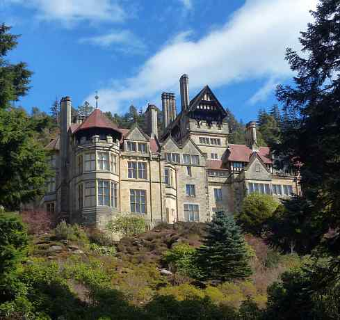

# As the aftershocks of the war in Iran continue to affect fossil fuel supplies, here is a quiz on renewable energy technologies

**Author:** Srinivasan Ramani

---

Question 1

Now powering most EVs (particularly Chinese ones), LFP batteries owe much of their commercial viability to the polyanion cathode framework pioneered in the late 1980s by Nobel laureate John B. Goodenough and his associate, who was born in a small village in Tamil Nadu, and then became a leading figure in battery research. Name this scientist.

Question 2

From one Goodenough associate to another: while the scientist in Q1 laid the conceptual groundwork, the actual 1997 paper announcing LiFePO₄ as a cathode was led by a scientist from Kalahandi, Odisha. He is today a cell engineer at Apple Inc., helping power billions of devices worldwide. Name him.

Question 3

Named after a Russian mineralogist and first found in the Urals in 1839, identify this crystal structure revolutionising photovoltaics — its tandem solar cells have recently crossed nearly 35% efficiency, beating silicon.

Question 4

In 1987, a water-well worker in Bourakébougou, Mali, accidentally set off a blue flame that burned for weeks in a borewell. Decades later, the gas was found to be 98% pure. Name this naturally mined, newest “colour” of hydrogen.

Question 5

Back to LFP batteries; name the Fujian-born physicist who founded CATL in 2011, today the world's largest battery maker and LFP producer.

Questions and Answers to the previous day’s daily quiz: 1. Nehru served as the Prime Minister for how many years? Ans: 16

2. Nehru wrote many books. One of them traces the journey of India from ancient history to the final years of the British Raj. Ans: The Discovery of India

3. When did Nehru say this: “At the stroke of the midnight hour, when the world sleeps, India will awake to life and freedom.” Ans: On August 15, 1947, Tryst with Destiny

4. Who, in a letter, said, “Universally you are recognised as one of the most powerful influences for peace and conciliation in the world...”? Ans: Dwight D. Eisenhower

5. In 1955, then British PM Winston Churchill called Nehru with a title? Ans: The Light of Asia

6. Nehru wrote which article of the Constitution under the Directive Principles of State Policy? Ans: Article 44

7. Which is the conference that is being held here in the 1955 image? Ans: Bandung Conference

Early Birds: Lalchand Bhutani | Tito Shiladitya | Piyali Tuli | Parimal Das | Sudhir Thapa
