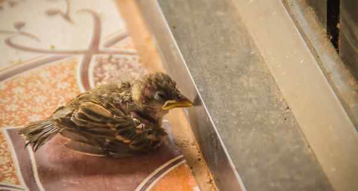

# Ordinary homes and offices are becoming death traps for birds

**Author:** Aditya Ansh

---

In 2008, architect and avid birdwatcher Peeyush Sekhsaria was having breakfast at a traditional homestay in Coorg when he heard a loud thud. Sekhsaria tracked down the cause of the noise to find an emerald dove lying still on the floor after flying into a glass panel.

Bird-glass collisions, also called bird-window strikes, happen because birds are not able to notice clear or slightly reflective glass.

India has no national estimate for bird-glass collisions, nor is there a coordinated monitoring system to track how many birds die or are injured after colliding with windows.

In one October 2025 study from the Nilgiris, researchers from around India documented 35 bird-glass collision incidents in two locations within a year. In Bengaluru, the Avian and Reptile Rehabilitation Centre (ARRC) has recorded more than 500 birds injured in collisions over the last three years.

“At Bengaluru, most of the major threats bringing birds to our rescue centre are human-made: manja is still the worst, but collisions are frequent,” ARRC executive director Jayanthi Kallam said.

Beyond skyscrapers

A major concern researchers and birdwatchers have is the nature of buildings involved in such accidents. Contrary to common perception, most collisions do not occur at skyscrapers but at everyday structures like homes, schools, office complexes, and apartment balconies.

“Glass collisions aren’t a skyscraper problem but they are a glass problem,” Dr. Kallam said. “People often imagine this as something that happens only at IT parks, corporate campuses or large glass buildings. But our cases come from ordinary urban spaces like homes, cafe fronts, schools, resorts and two- or three-storey buildings.”

Reflective surfaces mirror sky, foliage, and open space, creating what ecologists call a visual illusion. Transparent panes can also appear as clear flight paths. To birds moving quickly through urban vegetation, the barrier often remains invisible.

According to Mr. Sekhsaria, “The data in the U.S. shows us that 50% of bird deaths actually happen up to third-floor buildings and a lot of birds are active within a certain height range from the ground up to the canopy height.”

In Indian cities where residential towers and office buildings are often located alongside fragmented green spaces, the risk increases.

Glass near trees, balconies, and gardens can reflect the vegetation nearby, confusing birds.

Vulnerable migrating birds

Certain bird species are especially vulnerable. Between September and January, when birds migrate, ARRC said it often finds Indian pittas (Pitta brachyura) dazed or injured near buildings.

White-cheeked barbets (Psilopogon viridis) seem vulnerable during the March-April breeding season.

“At the moment, we are seeing many white-cheeked barbets, mostly newly fledged young birds that are inexperienced fliers, easily misled by reflections of foliage on glass,” Dr. Kallam said.

Asian koels (Eudanamys scolopaceus) also appear susceptible during breeding, possibly because of their higher territorial movement, which can bring them closer to reflective surfaces.

Pune-based birdwatcher Parth Barhate began noticing patterns similar to this after moving from Jalgaon: “Small bird species such as sparrows, robins, sunbirds and babblers are particularly vulnerable.”

According to experts at ARRC, bird-glass collisions are severely undercounted partly because collisions are hard to observe. Smaller birds may move away after the impact and die elsewhere, while some others are quickly removed by scavengers. The rescue centres eventually receive only a subset of injured or dead birds.

“When we looked more closely at building collision cases, nearly 70-80% involved glass in some form, be it windows, sliding doors, panels, reflective glass or facades,” Dr. Kallam said.

“And this is almost certainly an undercount. Small birds are easy to miss, many collisions are never witnessed and if a bird moves away from the impact site, identifying glass as the cause also becomes harder.”

Citizen science

In recent years, citizen-science platforms and informal reporting networks have begun filling some data gaps. Birdwatchers now upload collision records to platforms like iNaturalist. Rescue organisations also compile local observations.

Mr. Sekhsaria and his collaborators have analysed several hundred such records collected from online birding communities and wildlife rescue groups.

“We have about 110 species of birds that we have recorded having bird-window collisions,” he said. “For a country like India, a thousand data points is nothing, but we actually have some data points to begin with.”

“One common thing would be a head injury to birds,” Dr. Kallam said. “Post-concussion, they will be dull and dazed.” Some injuries are also difficult to spot by seeing: “Sometimes there could be internal organs bleeding. Those will be very difficult to diagnose,” she added.

According to her, many birds appear to recover briefly after impact, leading residents to release them too early. She said she believes substantial underreporting persists.

“Particularly in the small birds, which are difficult to notice, if it is impacted and goes some distance and falls in a wooded area, those are difficult for anybody to notice.”

Bird-safe cities

Researchers said the absence of regulations does not mean mitigation is impossible. Experts have pointed to many simple, inexpensive interventions. For example, patterns, decals or strips pasted on the outward-facing parts of windows can help birds identify glass surfaces as barriers.

“The first step is simple: make glass visible to birds,” Dr. Kallam said.

Awareness and understanding of bird-glass collisions also suffer from their absence in mainstream urban ecological discussions in the country. Conservation debates continue to focus on habitat destruction, air pollution, and infrastructure expansion.

One 2023 petition before the National Green Tribunal filed by a resident in Bengaluru had asked for the Ministry of Environment, Forest and Climate Change to draft bird-safe building guidelines. As of May 2026, no public update or draft framework has been released.

Mr. Sekhsaria said systematic citizen-science reporting may eventually shift that understanding.

(Aditya Ansh is an independent media writer based in New Delhi, India)
