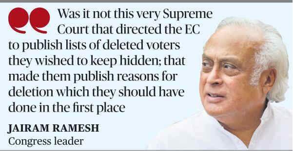

# Cong. ‘respectfully disagrees’ with Supreme Court on SIR

**Author:** The Hindu Bureau | **Location:** New Delhi

---

The Congress on Wednesday said it “respectfully disagreed” with the Supreme Court order upholding the legality of the special intensive revision (SIR) of electoral rolls, asserting that the judgement “raised more questions than it answered”.

“The Supreme Court has given a finding on law. We can respectfully disagree with the verdict,” Congress communication chief Jairam Ramesh said in a statement posted on X.

He alleged that the Narendra Modi government has been facing an “unprecedented wave of anger for its governance failures” and the SIR has become an exercise in exclusion.

“...unable to face the electorate in a fair contest, it has now opted to manipulate the lists of who can and cannot vote to skew the balance in its favour. Broadly speaking, this is what the SIR is for,” Mr. Ramesh said.

‘Selective deletions’

He claimed that voters in Bihar and West Bengal were selectively deleted en masse and then made to face an appeals process “that is arbitrary and ultimately meaningless”.

Mr. Ramesh said the Election Commission (EC) was in such haste that the Supreme Court itself had to put “guardrails”.

“Was it not this very Supreme Court that directed the EC to publish lists of deleted voters they wished to keep hidden; that made them publish reasons for deletion which they should have done in the first place; and that mandated Aadhaar be accepted when the EC tried to refuse,” he asked.

Mr. Ramesh alleged that the SIR process was “rife with infirmities and based on mala fide” and added that legal sanction may confer prima facie legitimacy, but it “cannot cure malice in implementation”.

Addressing a press conference, Congress leader and Rajya Sabha member Abhishek Singhvi said the top court had itself underlined “gaps, omissions, errors and deficiencies” in the EC’s handling of the exercise, which later required judicial intervention and petitions from political parties and civil society groups.

He pointed out that the court had observed that citizenship could be determined only by the competent authority, primarily the Ministry of Home Affairs, and not by the EC. He questioned whether the court should have taken stronger note of the fact that voters were excluded on citizenship-related grounds.

He also criticised the timeline for the exercise, describing it as an “excessively constricted and telescoped time period”.
