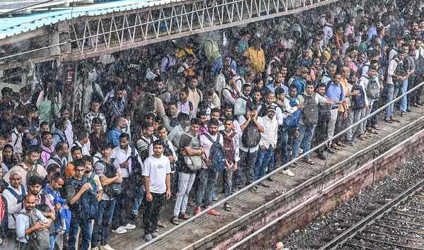

# Demography panel chief says subject is new to him, will consult experts

**Author:** Vijaita Singh | **Location:** New Delhi

---

The head of the first-of-its-kind panel to study demographic changes in the country said on Wednesday that the government had authorised the committee to invite demographers and experts who can weigh in on the subject and help prepare the report.

Retired Supreme Court judge Prakash Prabhakar Naolekar, 83, told The Hindu that the government’s decision to name him as the chief of the High-Level Committee on Demographic Changes (HLCDC) came as a surprise. “I have been living in Jabalpur since 2016, after I retired as the Lokayukta of Madhya Pradesh. Even I was surprised when they announced my name. I will reach Delhi soon and call a meeting of all other panel members,” he said.

He said demography and illegal migration were new subjects for him, and the scope of the study was vast, for which they would decide on a procedure soon. He added that his earlier judgments in the Supreme Court included the confirmation of the death sentence for Afzal Guru, convict in the 2001 Parliament terror attack, in 2005, and the 2007 judgment on defining copyright limits on court judgements. He comes from a third-generation family of lawyers and retired from the apex court in 2008.

Other members

Census Commissioner Mritunjay Kumar Narayan; retired IAS officer Durga Shanker Mishra, who served as the Chief Secretary of Uttar Pradesh; retired IPS officer Balaji Srivastava, who retired as Director-General of Bureau of Police Research and Development; and Shamika Ravi, who is part of the PM’s Economic Advisory Council; are the members of the committee. The Joint Secretary (Foreigners-I), Home Ministry, is the member secretary of the Committee. The panel’s office will be located in Delhi and it is expected to submit its report in a year.

‘A farce committee’

Manoj Kumar Jha of the Rashtriya Janata Dal questioned the composition of the committee. “What a farce. A committee constituted to examine ‘demographic change’ appears to have no demographer. A committee on demographic change without demographers is like a ‘medical board’ without doctors; heavy on administration, light on knowledge,” Mr. Jha said on X.

The Union Home Ministry said on Wednesday that demographic changes in the country were not restricted to border areas alone and were affecting “urban centres, industrial corridors, tribal regions, and other socially and economically sensitive areas”, which impacts public service delivery, local governance, resource distribution, and social cohesion.

In a resolution published in the Gazette, which notified the composition of the committee, the Home Ministry said the panel would also recommend a well-organised and permanent operational system for the legal, fair, and time-bound identification, detention, and deportation of illegal immigrants already residing in the country.

The constitution of the committee was announced by Home Minister Amit Shah on Tuesday, almost a year after Prime Minister Narendra Modi said that a demography mission was in the works.
