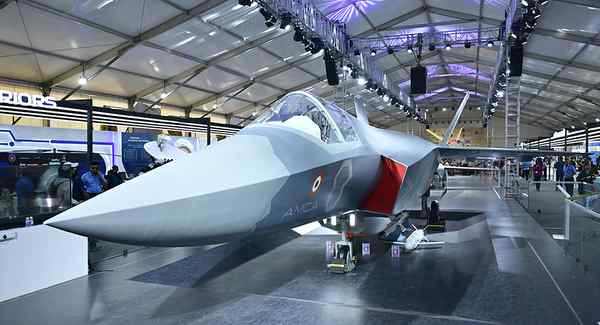

# AMCA fighter project moves ahead as Centre issues RFP to shortlisted firms

**Author:** Saurabh Trivedi | **Location:** New Delhi

---

The Ministry of Defence on Wednesday issued the Request for Proposal (RFP) for the indigenous fifth-generation Advanced Medium Combat Aircraft (AMCA) programme to three shortlisted bidders, marking a major step forward in India’s push for self-reliance in advanced combat aviation.

The shortlisted entities include the Larsen and Toubro-Bharat Electronics Limited combine, Tata Advanced Systems, and the Bharat Forge-BEML consortium. A top official in the Ministry of Defence confirmed the development to The Hindu. “It is a huge step towards the Make in India initiative of the Centre to develop an indigenous fifth-generation fighter jet,” the official said.

Interestingly, the State-run aerospace major Hindustan Aeronautics Ltd. has been kept out of the process, sources said.

After the shortlisted companies submit their responses to the RFP, the selection process is likely to be completed within four to five months based on technical and commercial evaluations.

Under the programme, the government plans to build five prototypes of the AMCA, a stealth fighter aircraft being developed to meet the Indian Air Force’s long-term operational requirements.

The selected private defence entity will work in partnership with the Aeronautical Development Agency, functioning under the Ministry of Defence, for the development of the prototypes.

The AMCA programme is considered one of India’s most ambitious indigenous aerospace projects aimed at developing a fifth-generation stealth combat aircraft with advanced avionics, supercruise capability, and reduced radar signature.

On May 15, Defence Minister Rajnath Singh and Andhra Pradesh Chief Minister N. Chandrababu Naidu laid the foundation stone for the ₹15,803-crore AMCA infrastructure project in Andhra Pradesh’s Sri Sathya Sai district.

Last year, the Defence Minister approved the AMCA Programme Execution Model, under which the Aeronautical Development Agency will execute the project through industry partnership.
