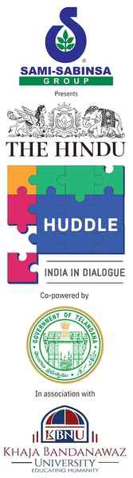

#  Conversation on complex politics of Kashmir to be held at The Hindu Huddle

**Author:** The Hindu Bureau

---

Adding early momentum to a power-packed line-up of expert speakers at The Hindu Huddle, 2026 will be a thought-provoking discussion with Omar Abdullah, Chief Minister of Jammu and Kashmir.

Mr. Abdullah, a multi-decade veteran of the complex politics of a Union Territory that has been the focus of intense policy attention, comes to the Huddle in the wake of persisting challenges in Jammu and Kashmir in the aftermath of last year’s Pahalgam terror attack and Operation Sindoor, which led to arguably the most consequential military skirmish between nuclear-armed neighbours India and Pakistan in recent times.

Mr. Abdullah, a two-time Chief Minister of J&K, entered politics setting a record as the youngest member of the Lok Sabha when he joined the Lower House of Parliament in 1998 at the age of 28. With successful stints in the Union government completed, including as Minister of State for Commerce and Industry and later for External Affairs, Mr. Abdullah turned his focus to his home State of Jammu and Kashmir, rising to prominence in the leadership of the National Conference.

Since then, he has made a name for himself as an outspoken Chief Minister representing the voice of the people of J&K, including during the challenging period of 2019-20 when the Centre revoked the special status of J&K by abrogating Article 370.

Today, as J&K still simmers with unresolved questions on addressing the demands of Kashmiri youth, halting cross-border terrorism and pursuing the right policy mix to spur growth in the Valley while fostering peace built on respect for human rights, Mr. Abdullah’s voice is one that speaks for the very heart of India’s great experiment with federalism, for the rights of the people of J&K. He will be engaged in candid dialogue with Dr. Narayan Lakshman, Opinion Editor, The Hindu, and Curator, The Hindu Huddle, in a session titled “Beyond the Valley: The role of Kashmir in great power politics”, at 10.20 a.m. on June 5.

The event is presented by the Sami-Sabinsa Group as the Presenting Partner. The event is co-powered by the Government of Telangana and held in association with Khaja Bandanawaz University.

The event is further supported by Bank of Baroda, Larsen & Toubro, Apollo Hospitals, IIM Sirmaur, ICFAI Group, TAFE, Wizzmoni, Associate Partners; Casagrand, Realty Partner; Toyota, Luxury Car partner; Amity University Bengaluru, University Partner; Harrow International School Bengaluru, Education Partner; Meghalaya Tourism, State Partner; and NDTV 24x7, TV Partner.
