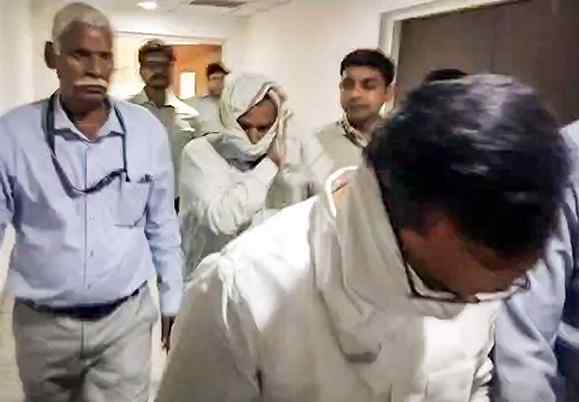

# CBI arrests two more in NEET-UG paper leak case

**Author:** The Hindu Bureau | **Location:** New Delhi

---

The Central Bureau of Investigation (CBI) on Wednesday arrested two more persons in connection with the National Eligibility-cum-Entrance Test-Undergraduate (NEET-UG), 2026 paper leak case. Those held include a Latur-based doctor and a member of the physics faculty of a coaching institute in Pune, officials said.

The agency arrested Manoj Shirure for allegedly playing a key role in facilitating three students, including the son of Renukai Chemistry Classes (RCC) coaching institute founder Shivraj Motegaonkar, to get the chemistry questions from NEET paper setter P.V. Kulkarni, they said. Mr. Motegaonkar, who ran the RCC in Latur, was recently arrested in the case.

The agency also arrested Tejas Harshadkumar Shah, a physics teacher at Dr. Abhang Prabhu Medical Academy (APMA), a Pune-based coaching centre, the officials said.

Mr. Shah allegedly received the leaked physics questions for the test from an arrested accused, Manisha Havaldar, they said.

The total number of arrests made in the paper leak case went up to 13, the officials said.

Probe on

“The investigation to unearth the chain as well as the conspiracy in this case is ongoing. The CBI has so far conducted searches at 49 locations and seized several incriminating documents, laptops, and mobile phones,” a CBI spokesperson said in a statement.

Manisha Waghmare, a beauty salon owner, was arrested on May 14 for allegedly facilitating the distribution of the leaked chemistry and biology questions. The others arrested are Dhananjay Lokhande from Ahilyanagar and Shubham Khairnar from Nashik in Maharashtra; Mangilal Biwal, Vikas Biwal, and Dinesh Biwal from Jaipur, Rajasthan; and Yash Yadav from Gurugram, Haryana.

On May 12, the National Testing Agency (NTA) cancelled the NEET-UG, held on May 3 for medical admissions, amid allegations of a paper leak. A re-test has been scheduled for June 21.

(With PTI inputs)

> **Key Highlights:**
> - *On May 12, the NTA cancelled the exam for admissions amid allegations of leak of the question paper*