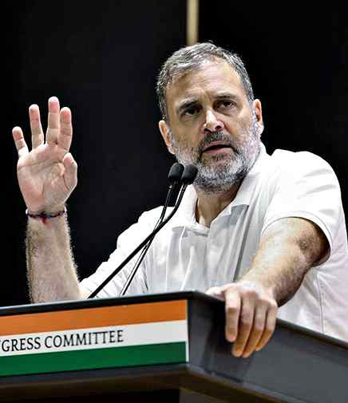

# Company used for CBSE on-screen marking linked to controversies, alleges Rahul

**Author:** The Hindu Bureau | **Location:** New Delhi

---

Leader of the Opposition in the Lok Sabha Rahul Gandhi on Wednesday alleged that the company, COEMPT, which carried out the on-screen marking (OSM) exercise for students of the Central Board of Secondary Education (CBSE), was earlier known as Globarena and had figured in controversies linked to Telangana Board exams in 2019 and 2023.

Mr. Gandhi has demanded a judicial inquiry and a Special Investigation Team (SIT) probe into the alleged scam.

“The company that did the OSM for your exams was actually called Globarena. And Globarena has carried out this scam twice before in Telangana, once in the Board exam in Telangana in 2019 and after that again in 2023,” Mr. Gandhi said in a video statement addressing students.

“The same OSM-based errors were responsible for death by suicides of 23 young Indians in Telangana,” he added.

‘Question selection’

Mr. Gandhi posted the video on his X handle and raised questions about the company’s selection. He also asked what, precisely, was the nature of the relationship between COEMPT’s management and the Union government. He alleged that the company’s track record was publicly known and yet, for “some hidden” reason, the CBSE chose it for the assignment. “It took us 30 seconds to figure out this company was earlier called something else. I am absolutely certain that the people in CBSE and the Government of India were aware of this company,” Mr. Gandhi said, urging students and parents to share the video and seek answers.

“Why and by whom was COEMPT given this CBSE contract? Which procedures were circumvented to give this contract?” the Congress leader asked.

Congress communications chief Jairam Ramesh, citing a media report claiming that the CBSE ignored the advice of its governing council to first implement OSM as a pilot project, demanded the resignation of Union Education Minister Dharmendra Pradhan. “If it [the CBSE] had listened, the unnecessary suffering of lakhs of students would have been prevented,” he said.
