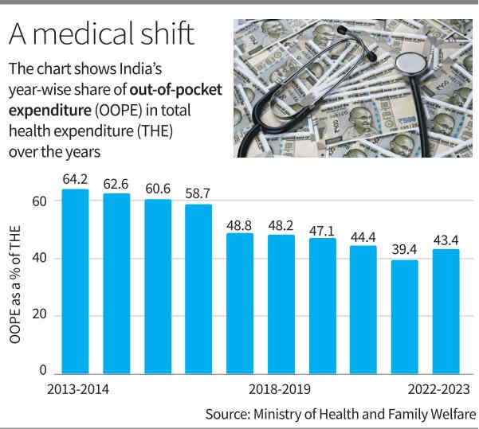

# Health expenses dip as govt. spend rises

**Author:** Bindu Shajan Perappadan | **Location:** NEW DELHI

---

Concurrent with the increase in government health expenditure, the out-of-pocket expenditure (OOPE) share in total health expenditure has declined by 21%, from 2013-14 till date, noted the National Health Accounts (NHA) estimates for India 2022-23, released by the Union Health Ministry on Wednesday .

The OOPE as a share of the total health expenditure has been calculated as 43.4% in 2022-23, as against 64.2% in 2013-14.

“This declining trend of OOPE indicates the improved access to health services, leading to reduced financial burden on the households,” said a senior Health Ministry official. He added that this is also the impact of operationalisation of more than 1.8 lakh Ayushman Arogya Mandir wellness centres across the country, providing preventive and curative healthcare services closer to the community.

These centres provide free services across 12 expanded packages, including reproductive and child health, communicable/non-communicable diseases, free drugs/diagnostics services, teleconsultations, and preventive care through wellness sessions.

“These measures have reduced the episodes of sickness. On in-depth analysis, it has been observed that the purchase of pharmaceuticals, including health supplements, vitamins, protein and other supplements [from wellness centres], is the main driver of OOPE in the current estimates,” the Ministry said.

The NHA 2022-23 is the 10th report on health expenditure estimates prepared by the National Health Accounts Technical Secretariat (NHATS), National Health Systems Resource Centre, Ministry of Health and Family Welfare, using the System of Health Accounts (2011) framework.

The report indicates an increase in the share of government health expenditure in the country’s Gross Domestic Product (GDP). It has risen from 1.15% in 2013-14 to 1.43% in 2022-23.

Similarly, health expenditure’s share in general government expenditure has increased from 3.78% to 4.89% over the same period.

In per capita terms, government health expenditure has increased nearly 2.7 times, from ₹1,042 to ₹2,786 between 2013-14 and 2022-23.

To address the emergency COVID pandemic situation, the government increased the health expenditure significantly to 1.84% of GDP in 2021-22 towards managing the pandemic situation given these additional spending by the government as a one-time measure, OOPE as a percentage of total health expenditure during this period also declined to 39.4%.

Inter-temporal comparisons also reveal a positive trend in the growth of social security expenditure. Spending here increased substantially from 6% in 2013-14 to 9.9% in 2022–23.

The share of private health insurance has also increased, from 3.4% to 9.2%, clearly indicating improved health-seeking behaviour due to awareness.

> **Key Highlights:**
> - *The part reasons of OOPE in current estimates is purchase of pharmaceuticals and supplements from govt. centres*