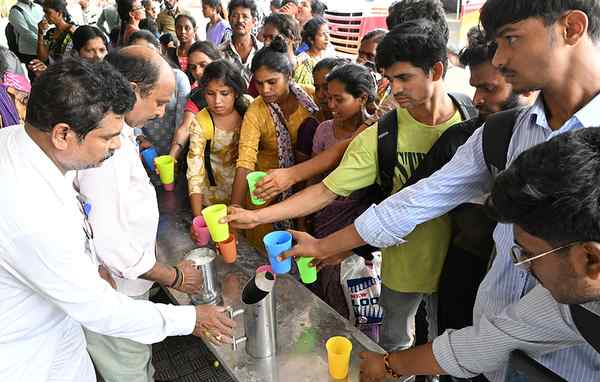

# Heatwave grips central and northwest India as monsoon stays offshore

**Author:** The Hindu Bureau | **Location:** NEW DELHI

---

Large swathes of central and northwestern India remained in the grip of a punishing heatwave on Wednesday, with the southwest monsoon yet to make landfall over Kerala — its customary point of entry into the subcontinent.

Banda in Uttar Pradesh recorded the season’s highest temperature with the mercury touching 47.4 degrees Celsius on Tuesday, according to the India Meteorological Department (IMD). Maximum temperatures ranged between 45 degrees Celsius and 47 degrees Celsius over Madhya Pradesh, Rajasthan, eastern Uttar Pradesh, Haryana and Vidarbha (Maharashtra), and between 40 degrees Celsius and 45 degrees Celsius across most of the rest of the country, barring Northeast India, the western Himalayas, the west coast and interior Tamil Nadu.

PM’s appeal

Prime Minister Narendra Modi, in an X post, urged citizens to stay hydrated, carry water while stepping out and remain alert to signs of heat exhaustion such as dizziness, nausea, and extreme fatigue. He cautioned that children, the elderly and outdoor workers were especially vulnerable, and appealed to people to keep bowls of water outside homes and shops for birds and animals.

The IMD said heatwave to severe heatwave conditions had prevailed in isolated pockets over eastern Uttar Pradesh and western Rajasthan. Heatwave conditions were also recorded over parts of eastern Madhya Pradesh, southern Haryana, western Uttar Pradesh, western Madhya Pradesh, Vidarbha and Chhattisgarh. The weather office said such conditions were likely to continue over central and northwest India for the next two to three days before abating from May 29.

For the monsoon, the IMD said the southwest monsoon had advanced further into parts of the Arabian Sea, the Lakshadweep area and the Bay of Bengal as on May 27. Its arrival over Kerala — for which the IMD had set a forecast window around May 26 — remains within the four-day margin of error built into the official prediction, with conditions favourable for further advance over the next two to three days.

The season ahead is clouded by the prospect of an El Nino, the Pacific warming pattern that typically suppresses monsoon rainfall over India. As of mid-May, the equatorial Pacific was rapidly transitioning into El Nino conditions.
