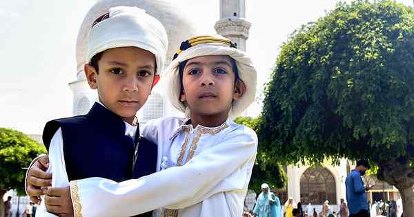

# Id celebrated in Kashmir; many offer prayers at Hazratbal

---

Id-ul-Azha, commemorating Prophet Abraham’s devotion and sacrifice, was celebrated across Kashmir on Wednesday with devotees gathering in large numbers at Idgahs, mosques, and shrines to offer prayers, officials said here. The largest congregation was at the Hazratbal shrine in Srinagar, where more than 60,000 people offered prayers, they said. Chief Minister Omar Abdullah, former CMs Farooq Abdullah and Mehbooba Mufti were among those who offered the prayers at Hazratbal. Smaller gatherings were reported from mosques and shrines across the Valley, except the Jamia Masjid in the old city. Lieutenant-Governor Manoj Sinha greeted the Muslim community on the occasion. PTI
