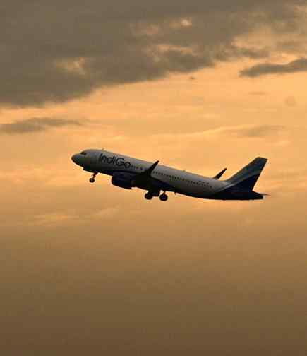

# AI, IndiGo cut over 250 domestic daily flights as ATF turns costlier, demand dips

**Author:** Jagriti Chandra | **Location:** New Delhi

---

Air India, its low-cost subsidiary Air India Express, and IndiGo will together withdraw around 250 daily domestic flights from June amid rising aviation turbine fuel (ATF) costs, a move expected to further drive-up airfares.

Airlines are also reporting weakening demand and subdued travel sentiment in what is already considered a traditionally weak season as travel demand typically softens from mid-June after the summer holiday period concludes.

Air India will cut 22% of its domestic flight schedule during June and July. The airline currently operates around 3,600 weekly domestic flights, or nearly 500 flights a day, meaning the reduction will translate into roughly 110 daily flights being withdrawn.

IndiGo, which operates nearly 2,200 daily flights, will reduce its domestic capacity by 5%, amounting to around 110 flights a day.

Air India Express, meanwhile, will cut nearly 10% of its approximately 340 daily flights on domestic routes.

The three airlines together enjoy 90% of the market share, in other words nine out of 10 air travellers fly with one of them. “These adjustments are driven by the sustained impact of high fuel prices on overall operations. Air India will continue to monitor demand and operating conditions closely,” Air India said in a statement.

IndiGo sources said a 5% cut was due to softer demand as travellers cut back on discretionary spending on top of it being a lean travel season following the summer holiday rush.

A 25% rise in aviation turbine fuel (ATF) prices for domestic flights and nearly a 100% increase for international operations due to the West Asia conflict has sharply raised operating costs for airlines, pushing airfares up by 40-50% on several routes. Airlines had also imposed a fuel surcharge of ₹400-450 in response. Industry observers said the latest capacity cuts could drive fares even higher.

Meanwhile, airlines have also started restoring capacity on West Asia routes as airspace restrictions ease across most destinations in the region, with Kuwait remaining among the few exceptions.
