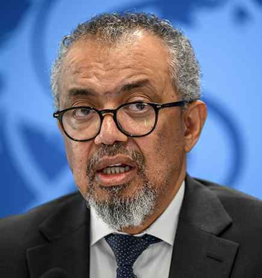

# ‘DRC facing catastrophic collision of Ebola and war’

**Author:** Agence France-Presse | **Location:** Geneva

---

The World Health Organization chief warned on Wednesday that conflict raging in eastern Democratic Republic of Congo was dramatically complicating efforts to rein in a deadly Ebola outbreak and urged an immediate ceasefire.

“Eastern DRC now faces a catastrophic collision of disease and conflict with the Ebola outbreak in Ituri province outpacing the response,” Tedros Adhanom Ghebreyesus said on X.

The WHO has recorded 10 confirmed Ebola deaths and 220 suspected deaths in DRC since mid-May, while also recording a further 900 suspected cases since Kinshasa declared the outbreak on May 15.

The United Nations’ health agency said the true spread of the virus was probably much wider. Experts have said it was probably circulating for some time.

Mr. Tedros stressed that the Bundibugyo strain of Ebola that is spreading in the DRC had “no approved vaccine nor treatment”.

“Stopping this Ebola transmission depends entirely on humanitarian access,” he said.

But insecurity is a huge obstacle in eastern DRC, which has been plagued for three decades by conflict involving a litany of armed groups.

State services in rural areas of Ituri province have been largely absent for decades.

Mr. Tedros lamented that clashes were “driving mass displacement, pushing exposed contacts into overcrowded camps and severing critical containment corridors”.

“Frontline workers are risking everything, while attacks on health facilities make tracking cases and their contacts nearly impossible,” he warned.

“We plea to prioritise human survival above everything else.”
