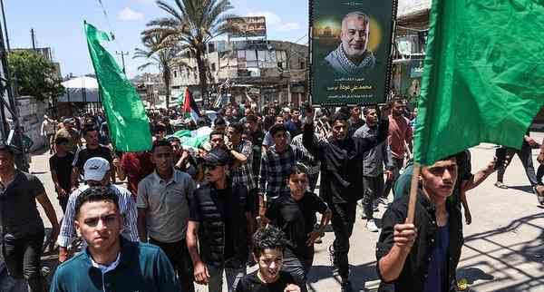

# Israel says it killed the new head of Hamas armed wing in Gaza strike

---

Israel said on Wednesday it had killed the new head of Hamas’s armed wing in Gaza, Mohammed Odeh, after killing his predecessor earlier this month despite an ongoing ceasefire. Odeh is the fourth head of the Ezzedine Al-Qassam Brigades Israel claims to have killed since the start of the Gaza war. AFP
