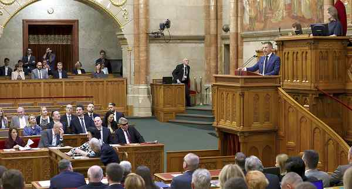

# Hungary’s Parliament votes to remain a member of the ICC

---

Hungary’s Parliament voted on Wednesday to remain a member of the International Criminal Court, reversing a decision by the previous government of Viktor Orban to withdraw from the global tribunal. The Bill was passed largely along party lines, with 133 voting to approve, 37 votes against and five abstentions. AP
