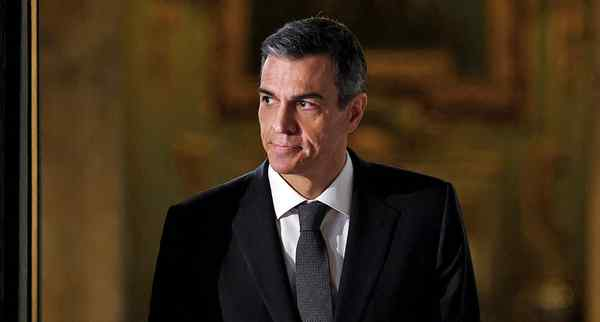

# Spanish PM sees ‘no reason’ to withdraw support for predecessor

---

Spanish Prime Minister Pedro Sanchez said on Wednesday there was “no reason” to withdraw support for his predecessor Jose Luis Rodriguez Zapatero, who is under investigation for corruption. Mr. Zapatero was placed under official investigation last week for influence peddling and other crimes. AFP
