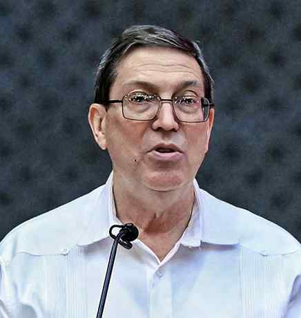

# Under U.S. pressure, Cuba appeals for international help

**Author:** Agence France-Presse | **Location:** United Nations

---

Cuban Foreign Minister Bruno Rodriguez Parrilla asked the international community for urgent help to prevent disaster in his country, which is under a U.S. energy blockade, in a speech to the UN Security Council on Tuesday.

“I call on the international community to mobilise to prevent a humanitarian catastrophe that could be imposed through arms or the fuel blockade,” Mr. Rodriguez said.

He added, “now should be the time for solidarity with Cuba”.

The day after the Castro indictment was announced, Secretary of State Marco Rubio warned Cuba that the United States was laser-focused on changing the communist system.

On Tuesday, Mr. Rodriguez called the indictment politically motivated and denied U.S. allegations that Cuba poses a threat to U.S.
