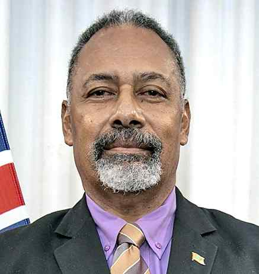

# Quad says ports for Fiji; Ditoka says no specific project yet, talks ongoing 

**Author:** Kallol Bhattacherjee | **Location:** NEW DELHI

---

A day after the 11th Quad Foreign Ministers’ meeting here declared that the grouping would build port infrastructure in the Pacific island of Fiji, Fijian Foreign Minister Sakiasi Ditoka said that no relevant port project has been “agreed” at the moment, though Fiji is in talks with the Millennium Challenge Corporation (MCC) Compact of the United States regarding port infrastructure. In response to questions from The Hindu, Mr. Ditoka said in a written response that Fiji’s approach to developing its infrastructure is driven by plans to create better facilities that will support its commercial ambitions.

“No specific port project has been identified or agreed at this stage. The process is at the Root Cause Analysis phase, which will then move into Concept Notes and, subject to agreement, potentially to more detailed feasibility and design work,” said Mr. Ditoka, indicating that the declaration of a port project made here by Australian Foreign Minister Penny Wong as well as U.S. Secretary of State Marco Rubio requires considerable paperwork before it can materialise.

The announcement on Fijian port development by the Quad Foreign Ministers’ meeting has drawn attention to the broad-spectrum relations that China has built with several southwest Pacific island nations, most importantly Fiji, which will mark fifty-one years of diplomatic relations with China this year. China’s ambassador to Fiji, Zhou Jian, said in 2025 that his country had emerged as the third-largest trading partner for Fiji. The government of Prime Minister Sitiveni Rabuka has broadened conversation on Chinese investments in infrastructure across Fiji’s major islands, and China has developed at least twenty projects in Fiji in the recent past. Fiji has maintained the “One-China” policy, which has helped further ties with Beijing.

On March 2, the U.S. Department of State announced that Fiji was set to receive a grant of $12 million from the MCC for feasibility studies of projects before further consideration. Referring to that, Foreign Minister Ditoka said, “The focus areas identified are ports and the business regulatory environment.”
