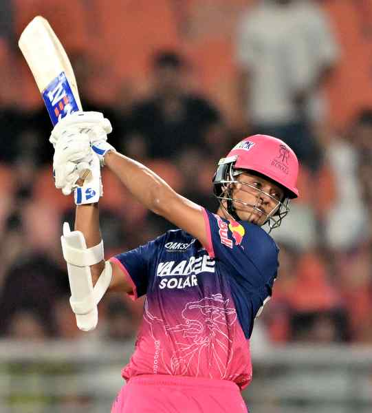

# Sooryavanshi and Jaiswal put on second-highest stand in a playoff

---

RR openers Vaibhav Sooryavanshi recorded the second-highest partnership in an IPL playoff match as they put together 125 runs against SRH in the Eliminator in New Chandigarh. Former CSK batters M. Vijay and Michael Hussey hold the record, having stitched a 159-run stand against RCB in the 2011 final.
