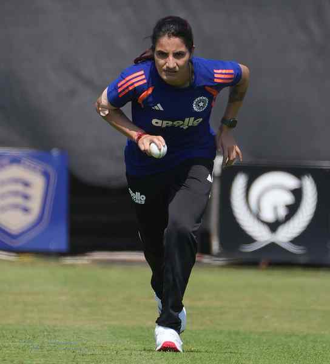

# India faces England in final tune-up before T20 World Cup

**Author:** Press Trust of India | **Location:** Chelmsford (UK)

---

India will look to regain consistency and finalise its combination in the final dress rehearsal for next month’s Women’s T20 World Cup when it takes on host England in a three-match series starting here on Thursday.

India’s preparations for the T20 World Cup have been a mixed bag. It began strongly with a commanding 5-0 clean sweep over Sri Lanka at home last December before scripting history in Australia by clinching a 2-1 T20I series victory. The momentum dropped during the subsequent South Africa tour where India endured a disappointing 1-4 defeat in conditions that exposed several concerns ahead of the marquee tournament.

The batting lacked consistency, the middle-order struggled to finish games, and the bowling attack failed to deliver regularly in crunch moments as India looked out of rhythm for most of the series.

The England series thus gives India the opportunity to work on these aspects before its opening match against Pakistan on June 14.

England heads into the series missing regular skipper Nat Sciver-Brunt, who is continuing her recovery from a calf injury.

The teams (from): England: Charlie Dean (Capt.), Em Arlott, Tammy Beaumont, Lauren Bell, Alice Capsey, Sophia Dunkley, Sophie Ecclestone, Lauren Filer, Amy Jones, Nat Sciver-Brunt, Paige Scholfield, Linsey Smith, Danni Wyatt-Hodge and Issy Wong.

India: Harmanpreet Kaur (Capt.), Smriti Mandhana (Vice-capt.), Shafali Verma, Jemimah Rodrigues, Bharti Fulmali, Deepti Sharma, Richa Ghosh (wk), Sree Charani, Yastika Bhatia (wk), Nandni Sharma, Arundhati Reddy, Renuka Thakur, Kranti Gaud, Shreyanka Patil and Radha Yadav.

The schedule: May 28, Chelmsford (11 p.m.); May 30, Bristol (7 p.m.); June 2, Taunton (11 p.m.). All times IST.
