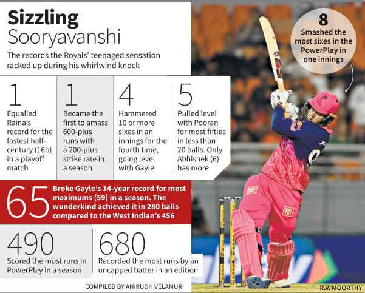

# Sooryavanshi, Archer carry Royals into Qualifier 2

**Author:** Vivek Krishnan | **Location:** New Chandigarh

---

Jaws were on the floor. Eyes were rubbed in disbelief. Deafening roar erupted from the stands.

The reason was who else but Vaibhav Sooryavanshi, the 15-year-old boy wonder with a booming bat swing who has taken to the bright lights of Indian cricket like a fish to water.

Transcending conventional logic ever since he set foot in the Indian Premier League last year, the Rajasthan Royals opener was at it again with his pyrotechnics in the Eliminator against Sunrisers Hyderabad at the Maharaja Yadavindra Singh Stadium here on Wednesday. He made a mockery of the Pat Cummins-led attack, smashing 97 off just 29 balls with five fours and 12 sixes.

Post the Sooryavanshi carnage, Dhruv Jurel took charge with a 21-ball 50. But considering that RR was 136 for one after 10 overs, an eventual total of 243 for eight was a clear case of the other batters misfiring.

Nevertheless, RR bowled out Sunrisers for 196 to celebrate a 47-run win, setting up a meeting with Gujarat Titans in Friday’s Qualifier 2.

Jofra Archer’s three-wicket burst at searing pace was riveting. The RR spearhead accounted for the trio of Abhishek Sharma, Ishan Kishan and Travis Head in a fiery opening spell as SRH was reduced to 57 for four.

When Heinrich Klaasen departed leg-before to Yash Raj, the writing was firmly on the wall.

On a flat pitch, SRH could do little but bow to Sooryavanshi’s brilliance. When he smashed his seventh maximum, he overhauled Chris Gayle’s record (59) for the most sixes in a single edition.

The teenager has bludgeoned 65 maximums this season. He nearly broke the Jamaican’s mark for the fastest century in IPL history too. Sooryavanshi attempted to dispatch Praful Hinge for the fourth six of the eighth over for the milestone. But his slash found R. Smaran at deep third.

It took the distraught youngster an eternity to leave the field to rousing applause.

As the night drew to a close, the applause was for the RR players to collectively soak in.
