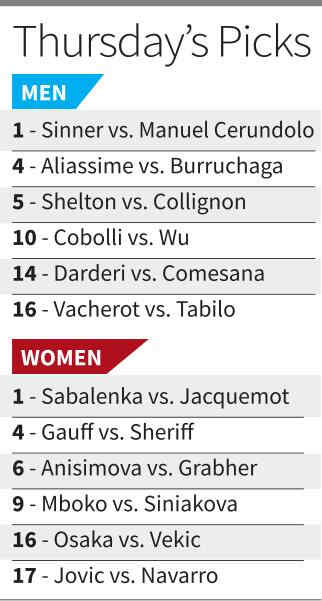

# Record-seeking Djokovic battles into the third round; Starodubtseva dumps Rybakina

**Author:** Agence France-Presse | **Location:** PARIS

---

Novak Djokovic extended his latest bid for a record-breaking 25th Grand Slam title with a four-set victory over Valentin Royer in the French Open second round on Wednesday, but women’s second seed Elena Rybakina crashed out of the tournament.

Swiatek moves up

Elsewhere, four-time champion Iga Swiatek and Elina Svitolina both eased into the last 32 with straight-sets wins.

Djokovic was pushed hard again by another Frenchman in Royer, before finally sealing a 6-3, 6-2, 6-7(7), 6-3 win after three and three-quarter hours.

Australian Open champion Rybakina blew a one-set lead to exit in dramatic fashion, slumping to a 3-6, 6-1, 7-6(4) loss to Ukraine’s Yuliia Starodubtseva.

It is Rybakina’s earliest departure from any tour-level tournament since the 2025 Miami Open and first defeat in the opening two rounds of a major since the 2024 Australian Open.

Swiatek, looking to regain the title she last won in 2024, saw off battling Czech youngster Sara Bejlek 6-2, 6-3 on Court Philippe Chatrier, while Svitolina, who beat Swiatek en route to the Rome title, beat World No. 126 Kaitlin Quevedo 6-0, 6-4.

Sinner has it easy

Meanwhile on Tuesday, World No. 1 Jannik Sinner put on a typically efficient display moving past French wildcard Clement Tabur 6-1, 6-3, 6-4. After taking all three clay-court Masters 1000 events in the run-up to Roland Garros, the 24-year-old Italian appears to have cracked the code to victory on the red dirt.

However, American fifth seed Jessica Pegula departed as she went down 1-6, 6-3, 6-3 to Australia’s Kimberly Birrell.
