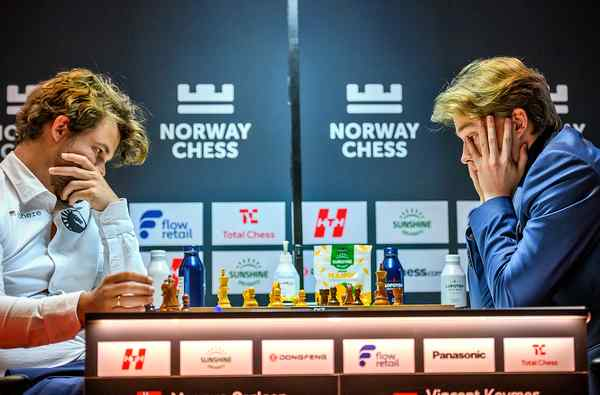

# Gukesh goes down to So; Firouzja too good for Pragg

**Author:** C. Shyam Sundar | **Location:** OSLO

---

A cat has nine lives is an age-old proverb. World champion D. Gukesh showed his survival instincts to come out unscathed against Vincent Keymer in his Norway Chess opener, but those couldn’t stand him in good stead in his second-round match against Wesley So.

Gukesh and So battled it out for 116 moves at Deichman Bjorvika before they signed peace in the classical game, with the Indian Grandmaster unable to take advantage of his superior position.

The American came out on top in the Armageddon late on Tuesday.

R. Praggnanandhaa, the other Indian in the fray in the Open event, was outclassed by Alireza Firouzja while home favourite Magnus Carlsen bounced back from his opening-round defeat to beat Keymer via Armageddon.

Firouzja, who is soldiering on despite an injured ankle, secured his second straight classical win, having shocked Carlsen on Monday.

“I am trying to play chess. I have a lot of pain, but chess is something that keeps me focused. It makes me not think about the pain,” the French GM said after his win.

Defending champion Carlsen ran into trouble against Keymer but managed to share the honours in the classical game.

He, however, came up trumps in Armageddon to earn his first points in the tournament.

In the women’s event, Divya Deshmukh pipped Koneru Humpy in Armageddon in an all-Indian contest while Bibisara Assaubayeva surged to the lead with a win over Zhu Jiner.

The results: Second round: Open: Wesley So (USA) bt D. Gukesh in Armageddon; R Praggnanandhaa lost to Alireza Firouzja (Fra); Magnus Carlsen (Nor) bt Vincent Keymer (Ger) in Armageddon.

Women: Zhu Jiner (China) lost to Bibisara Assaubayeva (Kaz) in Armageddon; Anna Muzychuk (Ukr) bt Ju Wenjun (China) in Armageddon; Divya Deshmukh bt Koneru Humpy in Armageddon.

(The writer is in Oslo at the invitation of Norway Chess).
