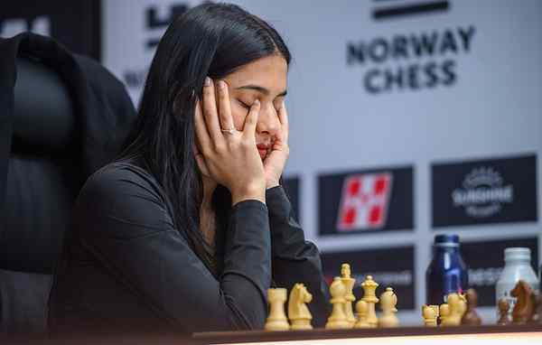

# Divya enjoys the uniqueness of Norway Chess

**Author:** C. Shyam Sundar | **Location:** OSLO

---

She comes across as a breath of fresh air in a game where most players aren’t too lively and appear reluctant to share bytes. Divya Deshmukh, one of chess’ fast-rising talents, seems to enjoy the spotlight and isn’t shy of expressing her thoughts.

A debutante at the Norway Chess tournament here, the 20-year-old Indian — who beat compatriot Koneru Humpy to the Women’s World Cup title last year — is showing why she’s rated so highly, that too in her inimitable style. She put it across Humpy yet again, defeating her in the second round here.

“I’m having a lot of fun with the Armageddon games; I love them. I’m actually enjoying the classical games too because there’s no increment. It’s my first time here, so it’s been really exciting,” Divya said.

That’s not all. She didn’t show hesitation to visit the ‘confessional booth’, a Norway Chess innovation introduced in 2015, which many Indian players have avoided over the years.

The ‘confessional booth’ is a private, soundproof room near the playing hall where players can briefly step away during a game to share candid, unfiltered thoughts for live broadcast viewers.

“I think it helps me because when I go there, I can talk about what is going on in my mind. It helps me to calculate better,” Divya said. “It was fun. It’s a great stress relief especially since you cannot talk for many hours when you play and have to just listen to the voices in your head,” she added.
