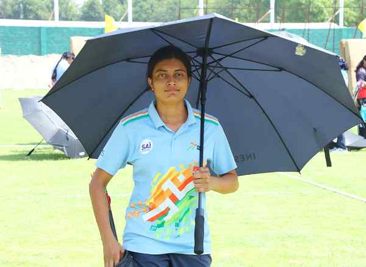

# Archer Chikitha’s exploits speak loud and clear

**Author:** Anirudh Velamuri | **Location:** Hyderabad

---

Chikitha Taniparthi may describe herself as soft-spoken and introverted, but her exploits with the bow and arrow have long spoken for her loud and clear.

Last year, she etched her name in history books by winning India’s first-ever women’s individual gold in the compound category at the under-21 World championships in Canada.

Transition

The 21-year-old has since made the transition to the senior team and is now set to make her Asian Games debut in Japan later this year.

“She credited Abhishek Verma for her strong showing at the trials.

“I didn’t have any expectations going into the trials because in the days leading up to the test, my trigger timing was off and, because of the wind, my scores were very low,” she told The Hindu.

Chikitha’s bid to make the squad was anything but straightforward.

“On the first day, I scored 693 and was ranked 13th. I didn’t shoot well. Abhishek anna pushed me to not hesitate. I listened to that and scored 351 and 351 (702). The following day, I totalled 353 and 352 (705). In the end, I was ranked sixth. In the round-robin stage, I won three matches in the morning and lost one with a tie. Abhishek kept speaking to me throughout. He even tuned my bow for me, initially. I pushed myself and won all my other matches and finished second.”

Bittersweet

Her own selection for the Asian Games was a bittersweet moment, given her mentor Abhishek didn’t make the cut.

“Since I came into archery in 2021, Abhishek has been my mentor and has supported me. I have complete trust in him. After I got selected, he told me to become an Asian Games champion and to bring him the toy as a gift.”
