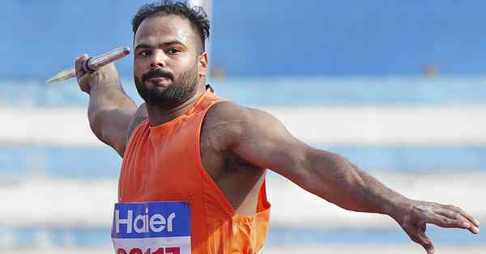

# Sumit Antil shatters own World record en route gold

---

Sumit Antil claimed the men’s javelin F64 gold at the eighth Indian Open Para athletics international championship in Bengaluru on Wednesday with a big throw of 74.82m. Antil’s winning attempt bettered his own World record of 73.29m set at the 2022 Asian Para Games. The two-time Paralympic champion got into the groove with a 70.30m fourth attempt, before reserving his best for the fifth try. The Haryana athlete dominated the nine-man field, with Maharashtra’s Sandip Sargar taking silver with 62.88m. Antil had won his third straight World para athletics gold at New Delhi last year.
