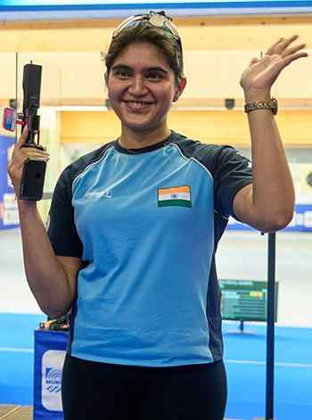

# Gold, World record for Esha in 25m pistol

**Author:** Press Trust of India | **Location:** MUNICH

---

Three-time World championship medallist Esha Singh bossed the women’s 25m pistol final with a World record score of 43 as she clinched the gold to open India’s medal count on the second day of the ISSF World Cup here on Wednesday.

In a power-packed final, the 21-year-old Esha shot perfect fives in half of the 10 series of five shots, leaving home favourite and former World champion Doreen Vennekamp a full five shots behind for silver. Bulgarian Miroslava Mincheva won the bronze.

It was Esha’s fourth individual World Cup medal.

Manu Bhaker and Rahi Sarnobat shot 582 and 581 to finish 12th and 14th in the 98-strong field.

In the women’s 50m rifle 3 positions, Ashi Chouksey missed out on a place in the finals by one point after she finished 10th effectively (12th overall), with 589 in a field of 70 shooters (including RPO).
