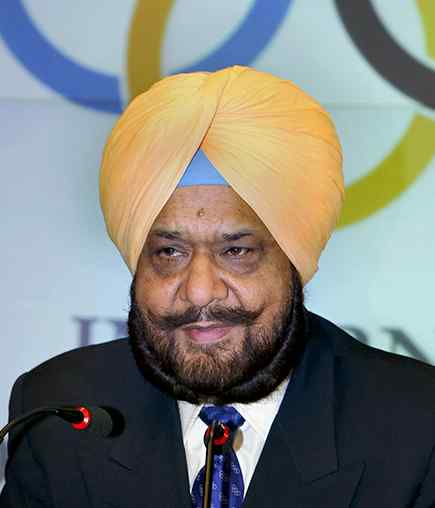

# Randhir Singh passes away

**Author:** Press Trust of India | **Location:** New Delhi

---

Veteran sports administrator and India’s first shooting gold-medallist in Asian Games, Randhir Singh, died here on Wednesday.

He was 79 and was hospitalised for several days before breathing his last at his residence here. He is survived by wife Vinita and three daughters — Mahima, Sunaina and Rajeshwari, who is also a shooter.

Randhir recently quit his position as the President of the Olympic Council of Asia (OCA) due to health issues, ending his run of over four decades as a sports administrator.

He was elected to the OCA top position for a four-year term in 2024, having already served the body as Secretary-General from 1991 to 2015.

Randhir’s career included five Olympic appearances between 1964 and 1984 and the trap gold at the 1978 Bangkok Asian Games that earned him the Arjuna Award in 1979.

In his equally successful administrative career, he served as the Secretary-General of the Indian Olympic Association (IOA) from 1987 to 2010 and was also a member of the International Olympic Committee (IOC) in different capacities from 2001 to 2014.

In 2003, he became IOC’s representative in the World Anti-Doping Agency (WADA) for two years.
