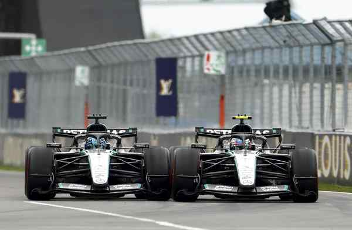

# Chaos in Canada

**Author:** Natalia Hannah Rice

---

There is a particular tension that settles over a Formula 1 pit wall when two teammates are fighting each other for the lead of a Grand Prix. It is not panic. It is something quieter and more complicated: the recognition that whatever happens next, someone inside the team is going to be unhappy. Toto Wolff sat through 30 laps of that feeling at Circuit Gilles Villeneuve on Sunday, watching Kimi Antonelli and George Russell trade positions, radio messages and, at one point, Pirelli rubber, in a battle that was as gripping as anything seen at this circuit in recent seasons.

Russell arrived in Montreal needing a statement. Three consecutive victories for Antonelli in China, Japan and Miami had pushed him 20 points clear at the top of the championship, and the Briton, who had dominated the Sprint, snatched pole position by 0.068 seconds and looked magnificent all weekend, was not prepared to concede ground quietly. He led from the front. He defended hard. He did everything a number one driver is supposed to do in a race that matters.

It was not enough. On lap 30, his Mercedes lost all electrical power and stopped on track. Russell climbed out slowly, removing the steering wheel with the disbelief of a driver who knew the race had been slipping away from him long before the car stopped. Antonelli drove off into the Quebec afternoon to claim his fourth win from five starts and extend his championship lead to 43 points, the highest-gap recorded in the first five races since 2020.

What happened between those two moments revealed everything about Mercedes’ future. The team now possesses two genuine title contenders, and no obvious way of controlling either.

A battle that couldn’t be managed

The tension between the two Mercedes drivers had been building across the entire weekend. Saturday’s Sprint had already offered a preview: Russell’s aggressive defence at Turn 1 sent Antonelli twice onto the grass and cost the Italian second place to Lando Norris. “That was very naughty! That should be a penalty,” Antonelli protested at the time. The stewards disagreed. On the cooldown lap he pushed further: “If we need to race like this, then good to know!”, before Wolff cut him off. Overnight, the two drivers cleared the air. They would race freely, but smartly. It was different. It was also, in its way, more intense. The pair swapped the lead repeatedly during a breathless opening phase, making minor contact, running wide at the hairpin in gusty conditions, and refusing on every occasion to give the other a moment’s comfort. The defining incident came on lap 24. Antonelli locked up approaching the hairpin, Russell came back ahead, and into the final chicane the two cars were side by side, paint rubbing off, before Antonelli was squeezed across the grass and rejoined in front. He was immediately instructed to surrender the position. “Why mate?!” he asked over the radio. “He pushed me off, and I was ahead. What’s the point?” He gave it back anyway.

Race engineer Pete Bonington delivered the pit wall’s verdict to Antonelli in clear terms: “So we’ve got to tidy up this racing. We need to keep it clean. So if we can’t keep it tidy, then we’ll have to stop you racing. Message to both cars.” Marcus Dudley said something similar to Russell. Wolff watched on. “Every time we thought about saying, ‘we have had enough for the moment’,” he would say afterwards, “the next two laps were fast again.”

Russell’s retirement rendered the debate temporarily moot. But it did not close. Wolff also served clear notice that future battles may not be allowed to run quite so freely: “As much as we look very sportsmanlike in Canada allowing it, there could be a situation where we would maybe turn it down a notch.” For a team that has publicly committed to letting both drivers race without imposed hierarchy, that is a significant statement. The 43-point gap has a way of concentrating minds.

Hamilton finds his Ferrari form

With the Mercedes drama consuming the front of the race, the most compelling secondary story came from further back. Lewis Hamilton, starting fifth in his Ferrari, delivered the finest afternoon of his 18 months at Maranello: patient, precise, and when the moment arrived, utterly decisive.

Verstappen had swept past Hamilton early in the race and built a gap of seven seconds once the field had cycled through its pit stops. What followed was a masterclass in controlled aggression. Lap by lap, Hamilton chipped away at the deficit, managing his medium tyres and calculating every deployment of battery power on a car that carries a known power deficit to Mercedes and Red Bull on the straights. With six laps remaining, he made his move, sweeping around the outside of Verstappen at Turn 1 in a pass that drew a roar from the Montreal grandstands and settled the battle for second.

Verstappen stayed within overtake range until the flag, applying relentless pressure, but Hamilton deployed the remaining energy with precision. “Even in overtake mode they still have more power in the straights,” he said. “I was just having to do these calculations, trying to figure out how to maximise the amount of power on my battery bar each straight. Thank God I managed to pull it off.” He called Sunday the “happiest day of my days at Ferrari so far”, his second podium for Scuderia and by some distance his most complete performance.

For Verstappen, third place was Red Bull’s first podium of the 2026 season, a small but meaningful sign that the team’s difficult adaptation to the new regulations may slowly be stabilising. “In a weekend when it’s not that easy to get things right, to be on the podium is extremely positive,” he said. Charles Leclerc, who had called Saturday the worst weekend of his career, recovered quietly to finish fourth, giving Ferrari two drivers in the top four.

McLaren’s strategic implosion

If the Mercedes drama was the race’s defining story, McLaren’s afternoon was its most painful subplot. The reigning constructors’ champions arrived in Montreal as genuine contenders. They left without a single point, their weekend undone by a tyre decision that backfired almost immediately and then spiralled beyond recovery.

With light rain falling before the race and the track surface cold and greasy, the team sent both Norris and Piastri out on intermediate tyres. The logic was understandable. Intermediates offered quicker warm-up on a cold and greasy circuit. But two additional formation laps altered the conditions completely, and by the time the race finally began the track was already drying. Piastri had asked for slick tyres before the start. McLaren persisted anyway.

Both drivers pitted almost immediately for slick tyres and spent the rest of their afternoon firmly in damage limitation mode. Norris retired mid-race with a suspected gearbox failure. Piastri’s afternoon deteriorated further when he collided with Alex Albon’s Williams while attempting an overtake, was handed a ten-second penalty, and eventually finished eleventh, two laps down. Team principal Andrea Stella defended the original call but accepted the outcome: “In hindsight, we were penalised by the decision.” The uncomfortable truth for McLaren is that this is not an isolated lapse. A pattern of strategic errors has accompanied their 2026 season, even as the car itself remains quick. Norris starts every weekend as the defending world champion and has yet to convert pace into points with the consistency Mercedes demands. That, rather than outright speed, remains the team’s most pressing challenge going forward.

What the standings say

Five races in, Kimi Antonelli leads the Drivers’ Championship on 131 points. George Russell is second on 88. Leclerc holds third on 75, Hamilton fourth on 72. Mercedes leads the Constructors’ standings comfortably.

The season is still young, and Russell’s retirement in Montreal accounts for much of a gap that does not fully reflect the closeness of their race pace. But championships are not decided on what might have been. Forty-three points is a very real number indeed. Wolff knows it. Russell knows it. Antonelli, for all the overnight reconciliations and press conference diplomacy, races like someone who knows it too.

Monaco is next. Mercedes will arrive on the Cote d’Azur still leading both championships, but carrying a problem every dominant Formula One team eventually encounters, two drivers convinced the future belongs to them. Montreal did not create the rivalry between Antonelli and Russell. It merely confirmed that neither man intends to yield.
