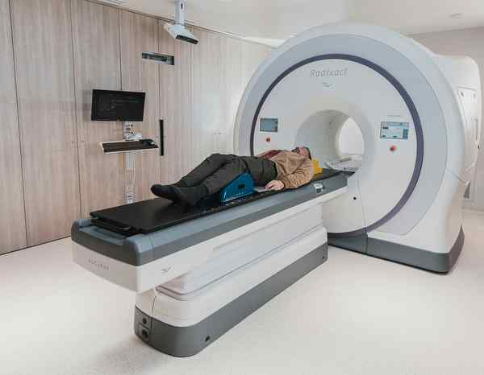

# Whole body scans: why investors love them but doctors hate them

**Author:** Narayana Subramaniam

---

When doctors express scepticism about whole-body scanning, a predictable counter-argument surfaces on social media within hours. Physicians, the theory goes, have a vested interest in keeping you undiagnosed. Healthy patients do not fill hospital beds. Early detection threatens the treatment economy and the doctor is the last person you should trust to tell you whether to scan. It is a compelling narrative.

It is also precisely backwards.

India now has a rapidly growing market for direct-to-consumer body scanning. Providers offer packages combining ultra-low-dose CT, full-body MRI, DEXA scans, blood biomarkers, and AI-generated health scores — all without a clinical referral, all marketed to urban professionals who want to know if something is wrong before a health calamity hits. The incentive structure is not to keep you healthy and out of the system. It is to bring you into a parallel one, charge you at the door, and generate findings that justify further investigation.

The metric these companies report is the number of abnormalities identified — not disease states confirmed, not findings that were clinically actionable, not conditions that required treatment. No company publishes outcome data showing their customers live longer. Yet all are growing rapidly.

The public conspiracy theory gets the incentives wrong in another way, too. When a scan returns an ambiguous finding — a nodule, a cyst, or a vascular irregularity, say — the patient does not stay home. They see specialists, undergo follow-up imaging, possibly biopsies, occasionally surgery. Every step generates clinical revenue. The scanning industry does not threaten the treatment economy; it feeds it.

What the evidence says

Earlier this month, two radiologists from leading American universities published an editorial in JAMA making the profession’s collective unease plain. Elective whole-body MRI screening lacks evidence of mortality or quality-of-life benefit and may cause harm through overdiagnosis, unnecessary procedures, and psychological distress. No major medical society recommends it for the general population.

But despite a similar warning three years prior, the commercial sector has only grown. Roughly three in ten people who undergo these scans will require follow-ups, most of which will resolve in a finding that needs no treatment.

Patients who enter the scanner feeling well leave feeling like patients, anchored to findings of uncertain significance that may shadow them for years. In effect, the scan has not caught a disease. It has manufactured a worry. This is the paradox at the heart of the industry.

Medicine has always known that oversimplification provides only temporary relief. It does not resolve uncertainty. Anxiety rooted in the complexity of the body cannot be treated with a protocol that flattens that complexity into a single report.

Double-edged sword

The standard criticism of whole-body scanning is overdiagnosis, i.e. detecting conditions that would never have caused harm. But there is an opposite failure as well. Covering the entire body in a clinically acceptable scan time requires compromises. Sequences are chosen for breadth, not precision. A dedicated brain MRI with sequences tuned for cerebral arteries is a fundamentally different investigation from the neurological portion of a whole-body scan. One is optimised for what it is looking at. The other is optimised for coverage.

There is currently an active malpractice case in which a patient received a clean whole-body MRI report and suffered a deadly stroke months later. Independent neurologists have alleged that significant narrowing of a major cerebral artery was present but undocumented — i.e. it was treatable but the scan had missed it. The defendants deny the allegations. Whatever the case’s legal outcome, it raises a question the industry has not answered: when a whole-body scan tells you nothing is wrong, what exactly has been excluded, and with what confidence?

Any test’s usefulness depends almost entirely on whom it is applied to. A test that is 95% sensitive and 95% specific applied to a population of 10,000, where true disease prevalence is 1%, will generate roughly five false positives for every genuine finding. This is the pre-test probability: the likelihood that disease is present before any test is ordered, estimated from symptoms, history, and risk factors. In a healthy, self-selected population, that probability is lower for nearly everything the scanner is looking for. An industry built on scanning the well is, by definition, built on this gap.

Overdiagnosis trap

There is a third failure: finding conditions that are real, accurately identified, and still best left undiscovered. Not all diseases require treatment. Autopsy studies from Finland found occult papillary thyroid cancers in up to 36% of adults who died of entirely unrelated causes — tumours that would never have surfaced clinically. In South Korea, fee-for-service providers began offering thyroid ultrasound as a cheap add-on to government cancer screening visits, though it was never part of official policy.

Thyroid cancer diagnoses rose fifteen-fold between 1993 and 2011. Surgical rates followed. Yet mortality did not budge. Tens of thousands underwent thyroidectomies and acquired lifelong hypothyroidism for a disease that was never going to shorten their lives. The pattern recurs in prostate and kidney cancer. Detecting subclinical disease and treating it is not always medicine — sometimes it is the harm.

Where the evidence points

The U.S. National Lung Screening Trial showed that annual low-dose CT reduced lung cancer deaths by roughly 20% compared with chest X-ray in a tightly defined population of heavy smokers. The Dutch-Belgian NELSON trial found a similar benefit against no screening at all. Cardiac calcium scoring carries guideline endorsement from major cardiology societies for adults at intermediate cardiovascular risk, where it resolves genuine uncertainty about whether to start statin therapy.

What all these checks share is specificity: a well-defined disease, a well-defined population, and a protocol built to answer a particular clinical question.

Scanning everyone for everything simultaneously answers no question well. The doctors raising concerns are not protecting a treatment monopoly. They are asking for the same standard applied to any other medical intervention: evidence that the thing being sold actually helps the people buying it. That is not a conflict of interest. It’s the job.

(Narayana Subramanian is Lead Consultant, Head and Neck Surgery and Oncology, Aster Hospitals, and Adjunct Faculty, Indian Institute of Science, Bengaluru. narayana.subramaniam@gmail.com)
