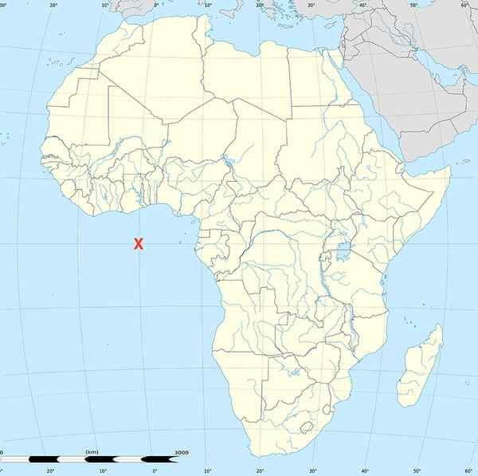

# Holiday spots for the really, really brave

**Author:** Vasudevan Mukunth

---

Question 1

The world’s longest unobstructed sea route that happens in a straight line goes from a point off the coast of Pakistan to the X Gulf in Arctic Russia, spanning around 32,000 km. A ship could theoretically sail it in a straight line (accounting for the earth's curvature) without making a single turn. Name X.

Question 2

Name the point on land that is farthest from any ocean coastline. It falls in Xinjiang, China, near the city of Ürümqi, roughly 2,645 km from the nearest sea. In the most literal sense, it is the most landlocked place on the earth: the shortest distance from here to the sea entails a two-month walk.

Question 3

______ Island is frequently cited as the most remote island on the earth. A Norwegian territory in the South Atlantic, it sits roughly 1,700 km from Queen Maud Land in Antarctica and 2,500 km from the tip of South Africa. It has no permanent population. Fill in the blank.

Question 4

The Y Channel is the name of a horizontal layer in the ocean around 700-1,000 m deep where the combined effect of temperature and pressure creates a zone where sound has a minimum velocity. Sound can flow in this channel with almost no loss, theoretically capable of travelling thousands of kilometres. The U.S. Navy has used it covertly to track submarines. Name Y.

Question 5

What is the name of the equator describing the belt of highest mean surface temperature on the earth’s surface? It runs around 5-10° north of the geographic equator. This equator exists because the Northern Hemisphere has more landmass, which heats more intensely than oceans.

Answers to May 21 quiz:

1. Condition due to parasitic worms blocking lymphatic system – Ans: Elephantiasis

2. Disease inflicting facial wounds resembling the gnawing of a wolf – Ans: Lupus

3. Bone changes caused by Paget’s disease, resembling a lion’s features – Ans: Leontiasis ossea

4. Stubborn variant of alopecia areata causing patchy hair loss – Ans: Ophiasis

5. Condition when fingers and toes are highly flexible – Ans: Arachnodactyly

Visual: Ichthyosis

First contact:

K.N. Viswanathan | Tamal Biswas | Prem Nath Tiwari | Pankaj Gharde | Prem Raj P.
