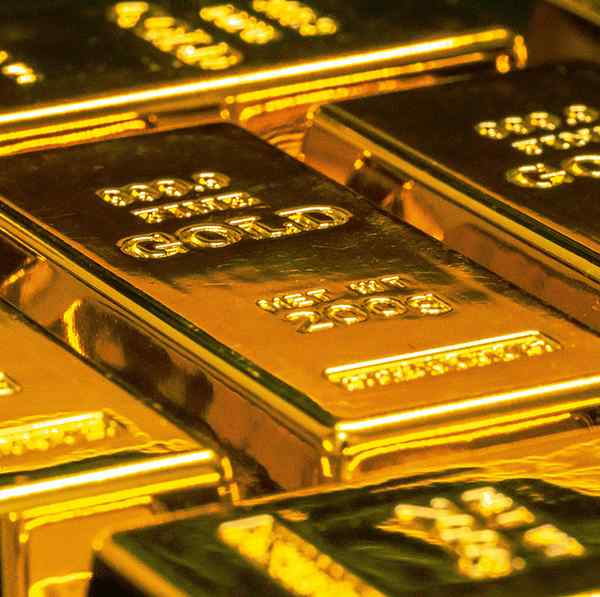

# Why does gold never rust? Its surface may have the clue

**Author:** Vasudevan Mukunth

---

Gold is one of the least reactive metals. It neither rusts like iron nor tarnishes like silver. In fact, this property has made gold the symbol of permanence worldwide. At the same time, chemists have used gold as a catalyst, including in reactions that involve oxygen. But if gold can accelerate oxidation reactions, why does it not react with oxygen to rust? In a new study in Physical Review Letters, Santu Biswas and Matthew Montemore of Tulane University in the U.S. have an answer: its surface.

When an oxidation reaction begins, oxygen molecules must split up into atoms. Gold struggles to make this happen. The researchers examined gold surfaces with two different arrangements of atoms, called Au(100) and Au(110). Normally, these surfaces are not flat because their outermost atoms rearrange themselves into more densely packed roughly hexagonal patterns in a process called surface reconstruction.

They do this because the new arrangement has lower surface energy, which is desirable. (In water, the surface molecules have more energy than in the bulk. This undesirable situation is the source of surface tension.) The researchers wanted to know if this process was responsible for gold’s shyness with oxygen. They used density functional theory, a well-known computational method to simulate how atoms and electrons behave, comparing unreconstructed gold surfaces to reconstructed ones. They also estimated the amount of energy an oxygen molecule would need to split apart after being adsorbed to a gold surface. They found that before reconstruction, Au(100) and Au(110) both had a rectangular arrangement of atoms. On these surfaces, the oxygen molecule’s dissociation energy was 0.65-0.74 electron-volt (eV, a small unit of energy suitable for atomic settings). But once the surface had reconstructed, the dissociation energy rose well beyond 1 eV.

Further, kinetic modelling suggested that unreconstructed Au(110) had a surface oxygen coverage of 0.4 monolayers within 10 seconds in ambient conditions while a reconstructed surface achieved a small fraction of that over the same period.

Even when the researchers changed the assumptions in the model, reconstruction still suppressed oxidation by roughly nine to 12 orders of magnitude. Mr. Biswas and Mr. Montemore traced these significant effects of reconstruction to the atoms’ geometry. When an oxygen molecule breaks apart on a surface with a hexagonal grid of atoms, the gold atoms need to move significantly to accommodate the new bonding arrangements. But they can’t move — not with what energy they have anyway — which keeps the oxygen molecule from dissociating. The reported finding could change scientists’ understanding of why gold does not react with oxygen. The noble gases are called so because their atoms have a very stable configuration of electrons, and they are disinclined to form bonds with other atoms or molecules without receiving a lot of energy. In gold, the structural arrangement of its atoms in a solid also plays a role. According to Mr. Biswas and Mr. Montemore, their findings may point to a new strategy to design gold catalysts. If researchers can stabilise square or rectangular surface geometries, they may be able to make gold much more reactive in oxidation reactions.

> **Key Highlights:**
> - *Chemists have used gold as a catalyst for reactions involving oxygen, yet it is unable to react with the gas to oxidise and rust*